# Episode 2025-02-25

# Ingest Series: Ingest Pipelines 101

- What are they?
- What can they do?
- What they cannot do — a preemptive warning
- Best Practices
    - Start from test documents
        - Why? Watch, as it will become self-explanatory
    - Custom Log Format Walkthrough
        - Processors
            - What's the flow?
            - How does it differ from Logstash?
        - Parsing Log Lines
            - Dissect
            - Grok
            - When to use which?
        - Dates
        - Numbers
        - KV pairs
        - Error handling
    - Mapping your data
        - Create in advance?
        - Monolithic vs Component Templates
        - Using data_stream vs. Index

## Part 1: Full document parsing in Ingest Pipelines

### What are Ingest Pipelines?

Ingest pipelines let you perform common transformations on your data before indexing. For example, you can use pipelines to remove fields, extract values from text, and enrich your data, without needing to know Beats processors or Logstash pipelines.

**Nodes Required**

Ingest pipelines require Ingest nodes. By default, all hot nodes and coordinating nodes will also have the ingest node property, making them ingest nodes.

Ingest pipelines are comprised of _processors._ Supported processors are listed at [https://www.elastic.co/guide/en/elasticsearch/reference/current/processors.html](https://www.elastic.co/guide/en/elasticsearch/reference/current/processors.html)

This is actually a strength, however. As hot nodes scale, there is more distributed computational power for processing events. The events are distributed round-robin to the various nodes with an ingest flag.

**Limitations**

There are some limitations to be aware of:

- Fewer processors compared to Logstash's list of filters
- Harder to create custom plugins compared to Logstash's Ruby filter.
    - The `script` processor can do a lot, but things get riskier when you try to write full functions in Painless
- Conditional branching is not as flexible as in Logstash
- Troubleshooting _ongoing_ pipeline issues requires digging through logs
    - In Cloud, you must have Monitoring enabled (prefer a separate, dedicated cluster for this)
    - For on-prem clusters, you can monitor the node logs directly
    - There are ways to use `on_failure` with processors to redirect events that failed to parse to another index (ostensibly for reindexing later)
        - We will address these in the Ingest Pipelines 201 and 301 sessions
- Enriching is possible, but limited compared to Logstash (which can do full JDBC)
    - Enrich processor requires
        - Enrich policy
        - Dedicated index(es)

### Start your Ingest Pipeline journey with sample docs

We _could_ create sample docs ourselves, but there's a quick way to get a template with the format we'll need.

- Browse to **Stack Management -> Ingest PIpelines**
- 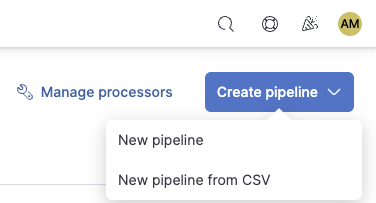
    In the top right of the browser pane, click on **Create Pipeline -> New Pipeline**
- 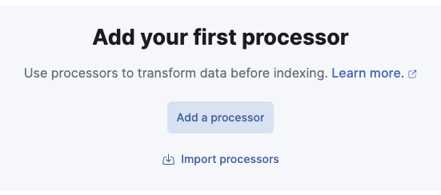
    Click on **Add a processor** in the middle of the window
- 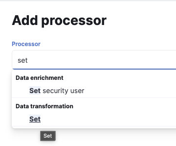
    Add a **set** processor
    - This is only a temporary addition to get the UI to allow us to add sample docs
    - 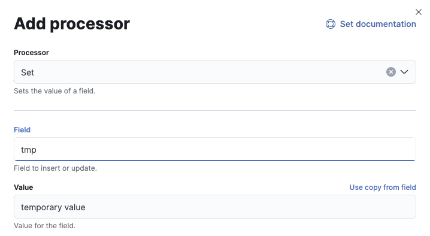
        Add field `tmp` and any arbitrary value you want for now.
    - 
        Click on **Add processor** in the bottom right corner
- 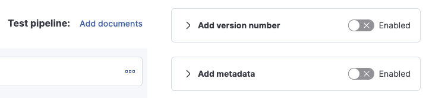
    Click on **Add documents** (it's on the upper right side of the processors pane)
- 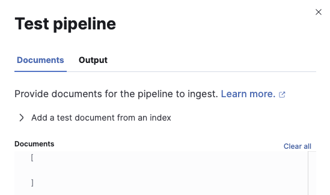
    This is where our future test documents will go:
    - Note that this is expecting an array  `[ ]` of JSON documents. In fact, it gives a sample format:
    - 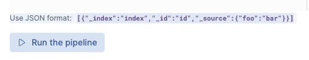
        Use JSON format: `[{"_index":"index","_id":"id","_source":{"foo":"bar"}}]`
    - Copy the JSON in its entirety, including the square braces.
- **_This is our starting point for making test docs._**

**Sample Docs**

Our sample doc looks like this. 

```
[{"_index":"index","_id":"id","_source":{"foo":"bar"}}]
```

or spaced out:

```
[
  {
    "_index":" index",
    "_id":"id",
    "_source":{
      "foo":"bar"
    }
  }
]
```

In order for this to be useful for our purposes, we need to create a field to parse. We'll use `message` as that is the default field name for unparsed messages coming in from Logstash or Agent/Beats.

```
[
  {
    "_index":" index",
    "_id":"id",
    "_source":{
      "message":"our message text"
    }
  }
]
```

As for the text, let's start with an apache log line:

`"message":"192.168.1.10 - - [24/Feb/2023:10:30:21 -0800] \"GET /home/index.html HTTP/1.1\" 200 1234 \"-\" \"Mozilla/5.0 (Windows NT 10.0; Win64; x64) AppleWebKit/537.36 (KHTML, like Gecko) Chrome/110.0.0.0 Safari/537.36\""`

Note that we are obliged to escape the double-quotes within the message so they don't break the JSON.

Our finished test doc looks like this now:

```
[
  {
    "_index":" index",
    "_id":"id",
    "_source":{
      "message":"192.168.1.10 - - [24/Feb/2023:10:30:21 -0800] \"GET /home/index.html HTTP/1.1\" 200 1234 \"-\" \"Mozilla/5.0 (Windows NT 10.0; Win64; x64) AppleWebKit/537.36 (KHTML, like Gecko) Chrome/110.0.0.0 Safari/537.36\""
    }
  }
]
```

**Save this and set it aside somewhere! It means not having to recreate it later!**

### Walk through of walking-through to parse your document

Now that we have a sample doc, let's go back and continue with the pipeline we started. If you closed that page already, just follow the steps and create another new pipeline.

Now, we can add our doc to the **Test pipeline / Add documents** area, like this: 
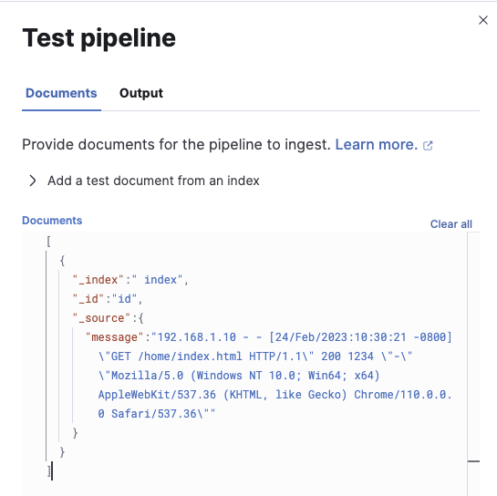

So long as our JSON is formatted correctly, it should look like this. If it's got angry red lines somewhere, perhaps one of the double-quotes was not escaped?

We can now click on **Run the pipeline**:


The output should look like this:
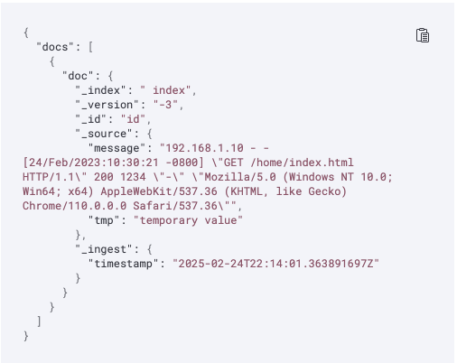

We could also capture it with the "copy to clipboard" icon in the top right corner of the window and it would look like this: 

```
{
  "docs": [
    {
      "doc": {
        "_index": " index",
        "_version": "-3",
        "_id": "id",
        "_source": {
          "message": "192.168.1.10 - - [24/Feb/2023:10:30:21 -0800] \"GET /home/index.html HTTP/1.1\" 200 1234 \"-\" \"Mozilla/5.0 (Windows NT 10.0; Win64; x64) AppleWebKit/537.36 (KHTML, like Gecko) Chrome/110.0.0.0 Safari/537.36\"",
          "tmp": "temporary value"
        },
        "_ingest": {
          "timestamp": "2025-02-24T22:14:01.363891697Z"
        }
      }
    }
  ]
}
```

Note that our `set` processor has added the `tmp` field with our temporary value. This is expected. Go ahead and close this dialog box.

**So what now?** We start walking through the `message` field and parse it accordingly.

Click on **Add a processor**
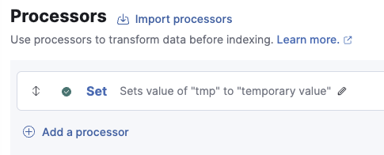

It's the link with the circled plus sign in the main pane.

This time, add a `dissect` processor. It should look like this to start:
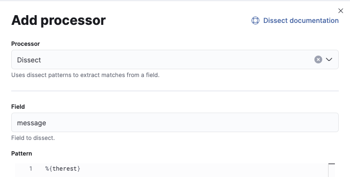

Our value for **Field** needs to be `message`, as that is the field we have in our JSON doc.

Our starting value for **Pattern** will be `%{therest}` . You will see why in a moment. Click on **Add processor** in the bottom right corner.

Our **Create pipeline** window should look like this in the middle now:
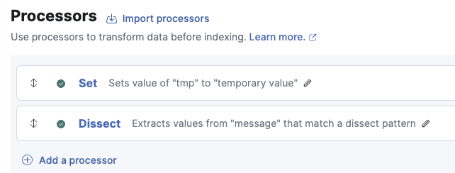

Now before we do anything else, let's click on **Dissect** again.

Now it looks a bit different than when we started:
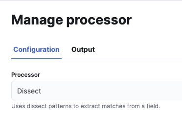

It now says **Manage processor**, and there's a tab labeled **Output**.

Let's click on **Output** and see what happens:
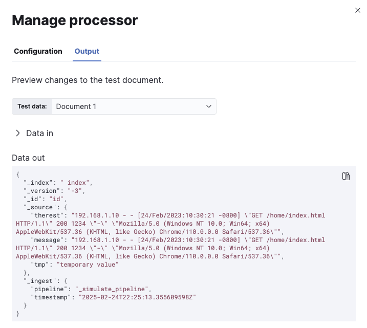

Hey! This looks familiar! This is our test doc. If we had more than one, we could actually switch using the dropdown and test a different document (saving that for a future session).

But this is great. We now see that field `therest` has the same content as `message`, which it should. Our `dissect` processor is just capturing it all. 

This is where the fun begins. 

Do not close this dialog. Click back on **Configuration** at the top there to go back to our processor configuration.

Change the **Pattern** to be `%{source.address} %{therest}`. It should look like this:
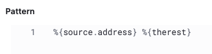

There **_must_** be a delimiter of some kind between the fields here. In this case, it's a simple space character. The `dissect` processor uses delimiters to determine field boundaries. Now that we've change this, let's click over to **Output** again:

```
{
  "_index": " index",
  "_version": "-3",
  "_id": "id",
  "_source": {
    "source": {
      "address": "192.168.1.10"
    },
    "therest": "- - [24/Feb/2023:10:30:21 -0800] \"GET /home/index.html HTTP/1.1\" 200 1234 \"-\" \"Mozilla/5.0 (Windows NT 10.0; Win64; x64) AppleWebKit/537.36 (KHTML, like Gecko) Chrome/110.0.0.0 Safari/537.36\"",
    "message": "192.168.1.10 - - [24/Feb/2023:10:30:21 -0800] \"GET /home/index.html HTTP/1.1\" 200 1234 \"-\" \"Mozilla/5.0 (Windows NT 10.0; Win64; x64) AppleWebKit/537.36 (KHTML, like Gecko) Chrome/110.0.0.0 Safari/537.36\"",
    "tmp": "temporary value"
  },
  "_ingest": {
    "pipeline": "_simulate_pipeline",
    "timestamp": "2025-02-24T22:31:58.425483977Z"
  }
}
```

Now we have a `source.address` field, we have `therest`, which is like `message` still, but with the IP address chopped out (it became `source.address`).

**Note**: The `_ingest` object is prepended by an underscore, making it metadata to Elasticsearch. We can take it and use it in the pipeline if we so desire, but it will not otherwise persist into our index.

Let's go back to **Configuration** and add some more.

Based on what remains in `therest`,  let's update our **Pattern** to look like this: `%{source.address} - - [%{timestamp}] %{therest}` 

Our delimiters here are the spaces, the dashes, and the square braces. We should have every character within the square braces become part of a field called `timestamp`. Let's see the **Output:**

```
{
  "_index": " index",
  "_version": "-3",
  "_id": "id",
  "_source": {
    "source": {
      "address": "192.168.1.10"
    },
    "timestamp": "24/Feb/2023:10:30:21 -0800",
    "therest": "\"GET /home/index.html HTTP/1.1\" 200 1234 \"-\" \"Mozilla/5.0 (Windows NT 10.0; Win64; x64) AppleWebKit/537.36 (KHTML, like Gecko) Chrome/110.0.0.0 Safari/537.36\"",
    "message": "192.168.1.10 - - [24/Feb/2023:10:30:21 -0800] \"GET /home/index.html HTTP/1.1\" 200 1234 \"-\" \"Mozilla/5.0 (Windows NT 10.0; Win64; x64) AppleWebKit/537.36 (KHTML, like Gecko) Chrome/110.0.0.0 Safari/537.36\"",
    "tmp": "temporary value"
  },
  "_ingest": {
    "pipeline": "_simulate_pipeline",
    "timestamp": "2025-02-24T22:37:18.895916189Z"
  }
}
```

Sure enough, we now have a `timestamp` field with a value of `24/Feb/2023:10:30:21 -0800`, and `therest` now starts with an escaped double-quote. Progress!

Let's add more in **Configuration**. Let's update our **Pattern** to capture the `GET`.  In terms of field names, the Elastic Common Schema would have us name this `http.request.method`, so our **Pattern** should look like `%{source.address} - - [%{timestamp}] \"%{http.request.method} %{therest}`  — note that we have to escape the double-quote here as well. That escaped quote is another delimiter. Our **Output**:

```
{
  "_index": " index",
  "_version": "-3",
  "_id": "id",
  "_source": {
    "timestamp": "24/Feb/2023:10:30:21 -0800",
    "tmp": "temporary value",
    "source": {
      "address": "192.168.1.10"
    },
    "http": {
      "request": {
        "method": "GET"
      }
    },
    "therest": "/home/index.html HTTP/1.1\" 200 1234 \"-\" \"Mozilla/5.0 (Windows NT 10.0; Win64; x64) AppleWebKit/537.36 (KHTML, like Gecko) Chrome/110.0.0.0 Safari/537.36\"",
    "message": "192.168.1.10 - - [24/Feb/2023:10:30:21 -0800] \"GET /home/index.html HTTP/1.1\" 200 1234 \"-\" \"Mozilla/5.0 (Windows NT 10.0; Win64; x64) AppleWebKit/537.36 (KHTML, like Gecko) Chrome/110.0.0.0 Safari/537.36\""
  },
  "_ingest": {
    "pipeline": "_simulate_pipeline",
    "timestamp": "2025-02-24T22:42:52.799652723Z"
  }
}
```

Now we see field `http.request.method` with a value of `GET`

Now, I could just fill in the blanks here and put the rest of the fields into our **Pattern** right now. I'm not doing that because part of this exercise is recognizing that walking through a bit at a time is:

1. Easy
2. Incremental
3. Less intimidating

Parsing in this manner is very approachable!

Our next addition will be `url.original`:

`%{source.address} - - [%{timestamp}] \"%{http.request.method} %{url.original} %{therest}` 

And the result:

```
{
  "_index": " index",
  "_version": "-3",
  "_id": "id",
  "_source": {
    "timestamp": "24/Feb/2023:10:30:21 -0800",
    "tmp": "temporary value",
    "source": {
      "address": "192.168.1.10"
    },
    "http": {
      "request": {
        "method": "GET"
      }
    },
    "therest": "HTTP/1.1\" 200 1234 \"-\" \"Mozilla/5.0 (Windows NT 10.0; Win64; x64) AppleWebKit/537.36 (KHTML, like Gecko) Chrome/110.0.0.0 Safari/537.36\"",
    "message": "192.168.1.10 - - [24/Feb/2023:10:30:21 -0800] \"GET /home/index.html HTTP/1.1\" 200 1234 \"-\" \"Mozilla/5.0 (Windows NT 10.0; Win64; x64) AppleWebKit/537.36 (KHTML, like Gecko) Chrome/110.0.0.0 Safari/537.36\"",
    "url": {
      "original": "/home/index.html"
    }
  },
  "_ingest": {
    "pipeline": "_simulate_pipeline",
    "timestamp": "2025-02-24T22:49:42.194691119Z"
  }
}
```

The next part is the `1.1` that follows after `HTTP/`which is named`http.version` in ECS.. Since it's all delimiters, our **Pattern** will look like this:

`%{source.address} - - [%{timestamp}] \"%{http.request.method} %{url.original} HTTP/%{http.version}\" %{therest}` 

Please note that because the very next character after the `1.1` is the escaped double-quote, we must match that in our **Pattern**, as shown. The result:

```
{
  "_index": " index",
  "_version": "-3",
  "_id": "id",
  "_source": {
    "timestamp": "24/Feb/2023:10:30:21 -0800",
    "tmp": "temporary value",
    "source": {
      "address": "192.168.1.10"
    },
    "http": {
      "request": {
        "method": "GET"
      },
      "version": "1.1"
    },
    "therest": "200 1234 \"-\" \"Mozilla/5.0 (Windows NT 10.0; Win64; x64) AppleWebKit/537.36 (KHTML, like Gecko) Chrome/110.0.0.0 Safari/537.36\"",
    "message": "192.168.1.10 - - [24/Feb/2023:10:30:21 -0800] \"GET /home/index.html HTTP/1.1\" 200 1234 \"-\" \"Mozilla/5.0 (Windows NT 10.0; Win64; x64) AppleWebKit/537.36 (KHTML, like Gecko) Chrome/110.0.0.0 Safari/537.36\"",
    "url": {
      "original": "/home/index.html"
    }
  },
  "_ingest": {
    "pipeline": "_simulate_pipeline",
    "timestamp": "2025-02-24T22:53:33.035445647Z"
  }
}
```

Only a few more to go, I promise!

The next field is the `200`, which is called `http.response.status_code` in ECS. Our updated **Pattern** looks like this:

`%{source.address} - - [%{timestamp}] \"%{http.request.method} %{url.original} HTTP/%{http.version}\" %{http.response.status_code} %{therest}` 

```
{
  "_index": " index",
  "_version": "-3",
  "_id": "id",
  "_source": {
    "timestamp": "24/Feb/2023:10:30:21 -0800",
    "tmp": "temporary value",
    "source": {
      "address": "192.168.1.10"
    },
    "http": {
      "request": {
        "method": "GET"
      },
      "version": "1.1",
      "response": {
        "status_code": "200"
      }
    },
    "therest": "1234 \"-\" \"Mozilla/5.0 (Windows NT 10.0; Win64; x64) AppleWebKit/537.36 (KHTML, like Gecko) Chrome/110.0.0.0 Safari/537.36\"",
    "message": "192.168.1.10 - - [24/Feb/2023:10:30:21 -0800] \"GET /home/index.html HTTP/1.1\" 200 1234 \"-\" \"Mozilla/5.0 (Windows NT 10.0; Win64; x64) AppleWebKit/537.36 (KHTML, like Gecko) Chrome/110.0.0.0 Safari/537.36\"",
    "url": {
      "original": "/home/index.html"
    }
  },
  "_ingest": {
    "pipeline": "_simulate_pipeline",
    "timestamp": "2025-02-24T22:56:36.157847132Z"
  }
}
```

Believe it or not, in spite of how much there appears to be, there's only 3 fields remaining. The next field is the `1234` which is called `http.response.body.bytes` in ECS. Our updated **Pattern** will look like this:

`%{source.address} - - [%{timestamp}] \"%{http.request.method} %{url.original} HTTP/%{http.version}\" %{http.response.status_code} %{http.response.body.bytes} %{therest}` 

Yeah, it's getting kind of long. The **Output**: 

```
{
  "_index": " index",
  "_version": "-3",
  "_id": "id",
  "_source": {
    "timestamp": "24/Feb/2023:10:30:21 -0800",
    "tmp": "temporary value",
    "source": {
      "address": "192.168.1.10"
    },
    "http": {
      "request": {
        "method": "GET"
      },
      "version": "1.1",
      "response": {
        "bytes": "1234",
        "status_code": "200"
      }
    },
    "therest": "\"-\" \"Mozilla/5.0 (Windows NT 10.0; Win64; x64) AppleWebKit/537.36 (KHTML, like Gecko) Chrome/110.0.0.0 Safari/537.36\"",
    "message": "192.168.1.10 - - [24/Feb/2023:10:30:21 -0800] \"GET /home/index.html HTTP/1.1\" 200 1234 \"-\" \"Mozilla/5.0 (Windows NT 10.0; Win64; x64) AppleWebKit/537.36 (KHTML, like Gecko) Chrome/110.0.0.0 Safari/537.36\"",
    "url": {
      "original": "/home/index.html"
    }
  },
  "_ingest": {
    "pipeline": "_simulate_pipeline",
    "timestamp": "2025-02-24T23:00:05.943019303Z"
  }
}
```

The next field is `\"-\"`. The field name in ECS is `http.request.referrer`, as it is the referring URL, if any. In Apache Web Server, if there is no referring URL, it logs a single dash to indicate an empty or null value. We will capture this for now, and handle it later. As this is also bounded by escaped double-quotes, we need to preserve those in our updated **Pattern**, which is:

`%{source.address} - - [%{timestamp}] \"%{http.request.method} %{url.original} HTTP/%{http.version}\" %{http.response.status_code} %{http.response.body.bytes} \"%{http.request.referrer}\" %{therest}` 

```
{
  "_index": " index",
  "_version": "-3",
  "_id": "id",
  "_source": {
    "timestamp": "24/Feb/2023:10:30:21 -0800",
    "tmp": "temporary value",
    "source": {
      "address": "192.168.1.10"
    },
    "http": {
      "request": {
        "referrer": "-",
        "method": "GET"
      },
      "version": "1.1",
      "response": {
        "bytes": "1234",
        "status_code": "200"
      }
    },
    "therest": "\"Mozilla/5.0 (Windows NT 10.0; Win64; x64) AppleWebKit/537.36 (KHTML, like Gecko) Chrome/110.0.0.0 Safari/537.36\"",
    "message": "192.168.1.10 - - [24/Feb/2023:10:30:21 -0800] \"GET /home/index.html HTTP/1.1\" 200 1234 \"-\" \"Mozilla/5.0 (Windows NT 10.0; Win64; x64) AppleWebKit/537.36 (KHTML, like Gecko) Chrome/110.0.0.0 Safari/537.36\"",
    "url": {
      "original": "/home/index.html"
    }
  },
  "_ingest": {
    "pipeline": "_simulate_pipeline",
    "timestamp": "2025-02-24T23:04:08.944627302Z"
  }
}
```

One more to go!

The final value is the user agent. It is also in escaped double-quotes, and is named `user_agent.original` in ECS. Our completed **Pattern** now looks like this:

`%{source.address} - - [%{timestamp}] \"%{http.request.method} %{url.original} HTTP/%{http.version}\" %{http.response.status_code} %{http.response.body.bytes} \"%{http.request.referrer}\" \"%{user_agent.original}\"` 

Note that with this final field, we no longer need `therest` to capture "the rest" of the field. Our final **Output** will now show:

```
{
  "_index": " index",
  "_version": "-3",
  "_id": "id",
  "_source": {
    "timestamp": "24/Feb/2023:10:30:21 -0800",
    "tmp": "temporary value",
    "source": {
      "address": "192.168.1.10"
    },
    "http": {
      "request": {
        "referrer": "-",
        "method": "GET"
      },
      "version": "1.1",
      "response": {
        "bytes": "1234",
        "status_code": "200"
      }
    },
    "message": "192.168.1.10 - - [24/Feb/2023:10:30:21 -0800] \"GET /home/index.html HTTP/1.1\" 200 1234 \"-\" \"Mozilla/5.0 (Windows NT 10.0; Win64; x64) AppleWebKit/537.36 (KHTML, like Gecko) Chrome/110.0.0.0 Safari/537.36\"",
    "url": {
      "original": "/home/index.html"
    },
    "user_agent": {
      "original": "Mozilla/5.0 (Windows NT 10.0; Win64; x64) AppleWebKit/537.36 (KHTML, like Gecko) Chrome/110.0.0.0 Safari/537.36"
    }
  },
  "_ingest": {
    "pipeline": "_simulate_pipeline",
    "timestamp": "2025-02-24T23:07:24.171517249Z"
  }
}
```

All of our ECS fields are now present:

- `source.address`  
- `http.*`
- `user_agent.original`

And our non-ECS fields:

- `url.original`
- `timestamp`

We still have our `tmp` field and our `message` field. We can decide what to do with them later.

For now, let's save our `dissect` processor by clicking on **Update** in the bottom-right corner:


After all of that work, our Ingest Pipeline looks deceptively simple, still:
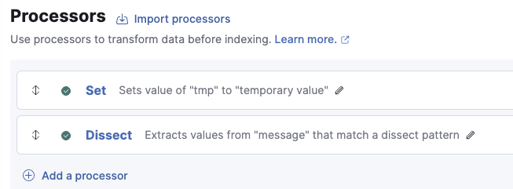

Now, before we lose this, let's name it and give it a description. **Name** should be lower-case alphanumeric and have no spaces or special characters. To avoid naming collisions with built-in and Fleet-managed ingest pipelines, avoid using `@` as part of your own ingest pipelines names. The exception of that rule are the `*@custom` ingest pipelines that let you safely add a custom pipeline to managed pipelines (more on this later). **Description** is free-form.
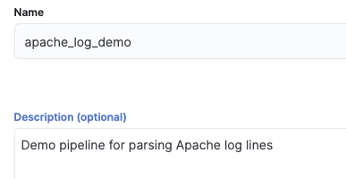

And then click on **Create pipeline** in the lower left corner of the main pane:


Let's go back to editing now by clicking **Manage -> Edit**
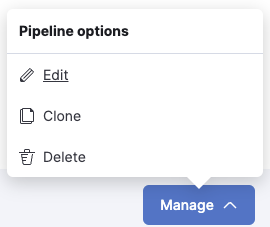

One of the first things I want you to note in particular is that your test document is **gone**. 
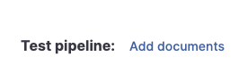

It's only there after you add it, right up until you hit either **Create pipeline** or on subsequent edits, **Save pipeline**. So let's click on **Add documents** again and put our document back in for testing (follow the previous steps). You saved it like I warned you, right? Once re-added, you can click on **Output** to reassure yourself that all that work was preserved:

```
{
  "docs": [
    {
      "doc": {
        "_index": " index",
        "_version": "-3",
        "_id": "id",
        "_source": {
          "timestamp": "24/Feb/2023:10:30:21 -0800",
          "tmp": "temporary value",
          "source": {
            "address": "192.168.1.10"
          },
          "http": {
            "request": {
              "referrer": "-",
              "method": "GET"
            },
            "version": "1.1",
            "response": {
              "bytes": "1234",
              "status_code": "200"
            }
          },
          "message": "192.168.1.10 - - [24/Feb/2023:10:30:21 -0800] \"GET /home/index.html HTTP/1.1\" 200 1234 \"-\" \"Mozilla/5.0 (Windows NT 10.0; Win64; x64) AppleWebKit/537.36 (KHTML, like Gecko) Chrome/110.0.0.0 Safari/537.36\"",
          "url": {
            "original": "/home/index.html"
          },
          "user_agent": {
            "original": "Mozilla/5.0 (Windows NT 10.0; Win64; x64) AppleWebKit/537.36 (KHTML, like Gecko) Chrome/110.0.0.0 Safari/537.36"
          }
        },
        "_ingest": {
          "timestamp": "2025-02-24T23:20:28.752618437Z"
        }
      }
    }
  ]
}
```

What's our next step? Let's make `timestamp` be our event date. This will involve using the `date` processor. Let's click on that **Add processor** link again and add a `date` processor (not the `Date index name` processor).
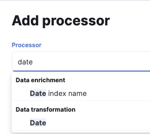

**Field** is going to be `timestamp`, which we parsed out using `dissect` previously. 

**Formats** is going to require us to build a [Java time pattern](https://docs.oracle.com/javase/8/docs/api/java/time/format/DateTimeFormatter.html) to represent the value `24/Feb/2023:10:30:21 -0800`

According to the documentation, we need to build it like this:

- `24` = `dd` for a 2 digit `day-of-month`
- `/` = the same, as it's a delimiter
- `Feb` = `MMM` for a 3 character `month-of-year`
- `/` = the same, as it's a delimiter
- `2023` = `yyyy` for `year-of-era`
- `:` = the same, as it's a delimiter 
- `10` = `HH` for a 2 digit `hour-of-day`
- `:` = the same, as it's a delimiter 
- `30` = `mm` for a 2 digit `minute-of-hour`
- `:` = the same, as it's a delimiter 
- `21` = `ss` for a 2 digit `second-of-minute`
-  = the same, as it's a delimiter 
- `-0800` = `Z` for `zone-offset`

All together, it reads like this: `dd/MMM/yyyy:HH:mm:ss Z`

Let's put that in and press `Enter`. The `date` processor can read from an array of values and uses a first-match-wins policy. We have to enter our string and press `Enter` to add it:
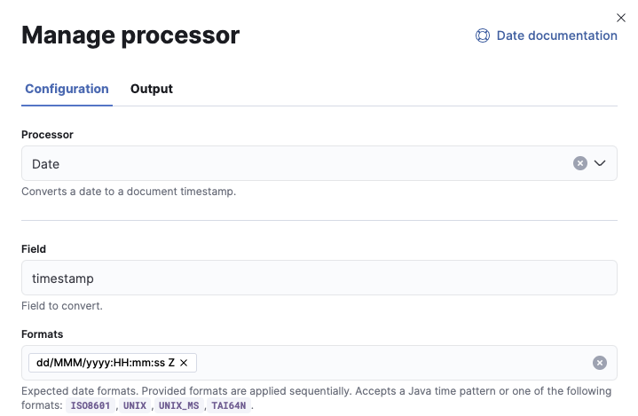

We have to now click **Add processor** in the bottom-right corner to add this processor before we can test it. You were looking for the **Output** tab at the top, weren't you?

Now we have three:
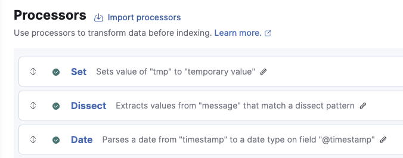

Click on **View output** to see the results on our test document:
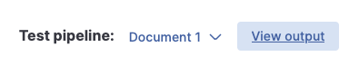

This is shortened for readability:

```
{
  ...
  "_source": {
    "timestamp": "24/Feb/2023:10:30:21 -0800",
    "@timestamp": "2023-02-24T18:30:21.000Z",
    ...
  }
}
```

So, our extracted `timestamp` is now `@timestamp`, which is the default timestamp field name for Elasticsearch. Let's see how it matched up:

- `2023-02-24` matches `24/Feb/2023`
- Because we have an 8 hour offset from UTC, our times also match up:
    - `10:30:21 -0800` matches `18:30:21.000Z` (where `Z` is Zulu time, which is shorthand for UTC)

**Parsing the user_agent**

Now we have our `user_agent.original` to parse. Conveniently, there's a `user_agent` processor that will do all of the work for us!

Go ahead and click on **Add a processor** again, and let's add a `user_agent` processor. The UI will match if you start typing `user`, and then select **User agent** from the drop-down that appears:
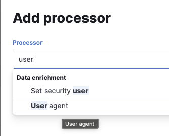

Just click on **User agent**. 
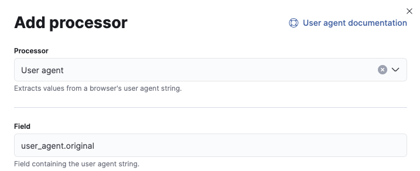

**Field** should be `user_agent.original`, which we extracted using `dissect` earlier.

That's it! While there are other configurable options, you should not need them in most cases. The default output field is `user_agent`, which is where ECS wants the values to go.

So let's hit **Add processor** in the bottom-right corner and then hit **View output** to see what comes out.

Shortened for readability:

```
{
  ...
          "user_agent": {
            "name": "Chrome",
            "original": "Mozilla/5.0 (Windows NT 10.0; Win64; x64) AppleWebKit/537.36 (KHTML, like Gecko) Chrome/110.0.0.0 Safari/537.36",
            "os": {
              "name": "Windows",
              "version": "10",
              "full": "Windows 10"
            },
            "device": {
              "name": "Other"
            },
            "version": "110.0.0.0"
          }
  ...
}
```

So our "original" is still there at `user_agent.original`, but the `user_agent` processor parsed out these other values from that value for us!

With this completed, it is not a bad idea to hit **Save pipeline** to save our work. If you do this, be sure to add your test document again.

**Converting strings to numbers**

Our ECS fields, `http.response.body.bytes` and `http.response.status_code`, appear to be string values, but should be numeric. If our index mapping has been properly set up, it won't matter that they are strings. For the sake of learning how this works, though, we're going to make sure that it's numeric in the JSON.

Starting with `http.response.body.bytes`, which can be quite large with some downloads, so we'll use the `convert` processor to make it **Type Long**
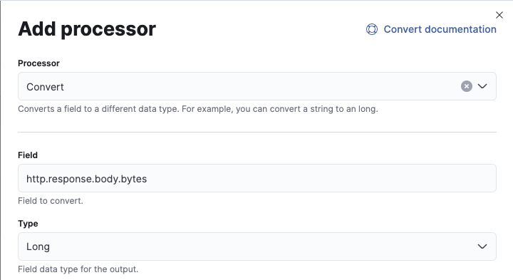

We will also use `convert` with `http.response.status_code`, which is never above 599. We can set that as a **Long** as well, but here we can set it to be **Integer**, too:
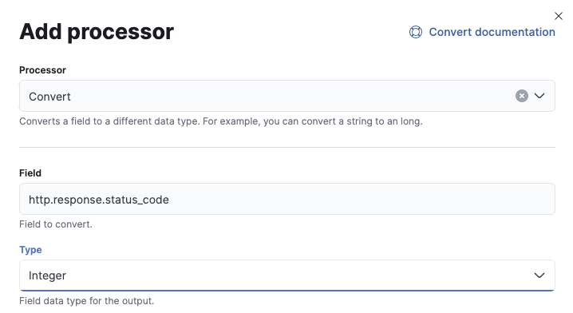

Before:

```
{
  ...
            "response": {
              "body": {
                "bytes": "1234"
              },
              "status_code": "200"
            }
  ...
}
```

After:

```
{
  ...
            "response": {
              "body": {
                "bytes": 1234
              },
              "status_code": 200
            }
  ...
}
```

Numbers!

**Removing unnecessary fields**

Now that we have these fields, we no longer need our initial `set` processor, so we can delete it from the main view.
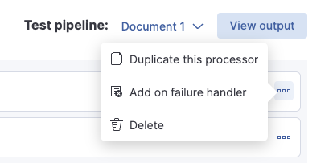

Just click the `...` for the  `set` processor and click on **Delete**.

**The "empty"** `http.request.referrer`

We only want to delete this field when the value is `-` , so we'll add a **Condition** to a `remove` field.

Let's add a new processor, make it a `remove` processor:
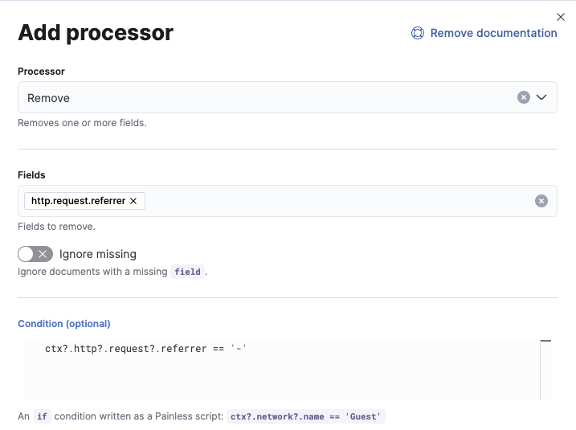

**Fields** is `http.request.referrer`

**Condition** is `ctx?.http?.request?.referrer == '-'` 

Let me explain what is going on here. This **Condition** is using the [Painless scripting language](https://www.elastic.co/guide/en/elasticsearch/painless/current/index.html) to evaluate whether the value of `http.request.referrer` is `-`. The `ctx` part is the document currently being evaluated, making `http.request.referrer` a field and subfields of that document. Adding the `?` is to protect against null pointer exceptions if the condition attempts to evaluate a doc that does not have either the `http` field, or its subfield `request`.  And for boolean equality testing, use `==`. Clear as mud, right? Just know that the example provided shows that this is the way you should always do things, and that should be pretty straightforward to follow. 

Save this processor and check your results:

Before:

```
{
  ...
    "http": {
      "request": {
        "referrer": "-",
        "method": "GET",
        "body": {
          "content": "/home/index.html"
        }
      }
    }
  ...
}
```

After:

```
{
  ...
    "http": {
      "request": {
        "method": "GET",
        "body": {
          "content": "/home/index.html"
        }
      }
    }
  ...
}
```

The field is now gone!

But what if we want to be _really_ sure it's not going to delete the field if it's not a dash?

This is where adding an extra document to our tests can help!

Click on **Document 1**, and select **Edit documents**:
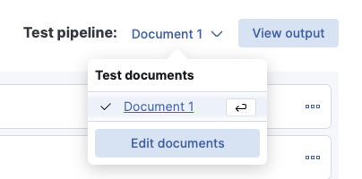

Replace it all with this. I just cloned the first document and edited the IP, the timestamp, and replaced the `-` with `http://referrer.example.com` :

```
[
  {
    "_index":" index",
    "_id":"id",
    "_source":{
      "message":"192.168.1.10 - - [24/Feb/2023:10:30:21 -0800] \"GET /home/index.html HTTP/1.1\" 200 1234 \"-\" \"Mozilla/5.0 (Windows NT 10.0; Win64; x64) AppleWebKit/537.36 (KHTML, like Gecko) Chrome/110.0.0.0 Safari/537.36\""
    }
  },
  {
    "_index":" index",
    "_id":"id",
    "_source":{
      "message":"192.168.1.11 - - [24/Feb/2023:11:31:22 -0700] \"GET /home/index.html HTTP/1.1\" 200 1234 \"http://referrer.example.com\" \"Mozilla/5.0 (Windows NT 10.0; Win64; x64) AppleWebKit/537.36 (KHTML, like Gecko) Chrome/110.0.0.0 Safari/537.36\""
    }
  }
]
```

Then we can Edit/Manage our Remove processor for the `http.request.referrer` field and click on the **Output** tab above. The **Test data** will show **Document 1**, which is the one with the `-` for this field. But let's look at **Document 2:**
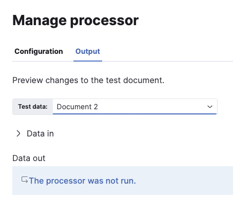

The processor was not run because the **Condition** was not met. We can expand **Data in** and see that the provided document has `http.request.referrer` set to `http://referrer.example.com`.

**Removing other unnecessary fields**

We still have the `timestamp` field, even though it is no longer useful. We also have the `message` field, which we may or may not want to keep.

The way to handle these is the `remove` processor. Let's add that one.
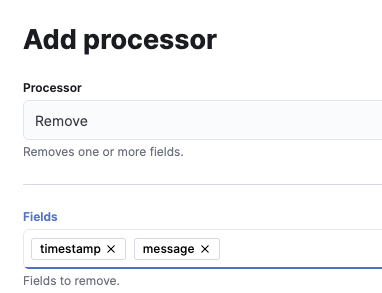

As with the `date` processor, the value of **Fields** is an array, which means adding field names one at a time, pressing enter each time.

With that as our final processor, let's see what **View output** shows us:

```
{
  "_index": " index",
  "_version": "-3",
  "_id": "id",
  "_source": {
    "http": {
      "request": {
        "method": "GET"
      },
      "version": "1.1",
      "response": {
        "body": {
          "bytes": 1234
        },
        "status_code": 200
      }
    },
    "source": {
      "address": "192.168.1.10"
    },
    "@timestamp": "2023-02-24T18:30:21.000Z",
    "url": {
      "original": "/home/index.html"
    },
    "user_agent": {
      "name": "Chrome",
      "original": "Mozilla/5.0 (Windows NT 10.0; Win64; x64) AppleWebKit/537.36 (KHTML, like Gecko) Chrome/110.0.0.0 Safari/537.36",
      "os": {
        "name": "Windows",
        "version": "10",
        "full": "Windows 10"
      },
      "device": {
        "name": "Other"
      },
      "version": "110.0.0.0"
    }
  },
  "_ingest": {
    "pipeline": "_simulate_pipeline",
    "timestamp": "2025-02-25T01:40:57.670830181Z"
  }
}
```

### Now do it with grok

Now let's talk about `grok`.  `grok` predates `dissect` by _years_. And it's still very popular. Let's go over the pros and cons of `dissect` and `grok` :

**Grok Pros**

- **Extremely flexible with what can be in a single line**
- **Can cast types inline (no need for the** `convert` **processor)**
- **Can use regular expressions to do either/or parsing**

**Grok Cons**

- **Easy to misconfigure with typos due to the syntax**
- **Slower to process**
- **A bit hard to learn**

**Dissect Pros**

- **Easy to read due to delimiter-based approach**
- **Can easily combine values from out-of-order fields**
- **Significantly faster and uses lower CPU than grok**

**Dissect Cons**

- **Your documents absolutely _must_ be uniform - no real flexibility in line "shape"**
- **Cannot cast directly to int/float (in Ingest Pipelines, anyway)**
    - **Requires more processors to do Convert, or proper document mapping**
- **Lack of either/or regex matching requires Conditional** `remove` **to achieve the same result.**

**In the long run,** `dissect` **is not the best for Apache log lines, but** `grok` **is fantastic for it.** 

So let's see what happens when we replicate this pipeline using `grok`.

**What should have been the "easy" way**

Pull up a `grok` processor, use `message` as the field, and then just one token parses it all out (because it's a well-known log format). 

The pattern token: `%{HTTPD_COMBINEDLOG}`
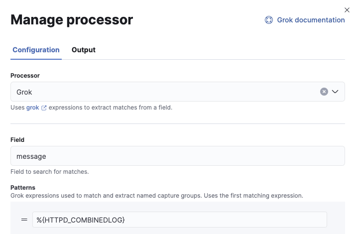

The initial document result from `grok` looks like this.

```
{
  "_index": " index",
  "_version": "-3",
  "_id": "id",
  "_source": {
    "request": "/home/index.html",
    "agent": "\"Mozilla/5.0 (Windows NT 10.0; Win64; x64) AppleWebKit/537.36 (KHTML, like Gecko) Chrome/110.0.0.0 Safari/537.36\"",
    "auth": "-",
    "ident": "-",
    "verb": "GET",
    "message": "192.168.1.10 - - [24/Feb/2023:10:30:21 -0800] \"GET /home/index.html HTTP/1.1\" 200 1234 \"-\" \"Mozilla/5.0 (Windows NT 10.0; Win64; x64) AppleWebKit/537.36 (KHTML, like Gecko) Chrome/110.0.0.0 Safari/537.36\"",
    "referrer": "\"-\"",
    "response": "200",
    "bytes": "1234",
    "clientip": "192.168.1.10",
    "httpversion": "1.1",
    "timestamp": "24/Feb/2023:10:30:21 -0800"
  },
  "_ingest": {
    "pipeline": "_simulate_pipeline",
    "timestamp": "2025-02-25T00:55:01.911716742Z"
  }
}
```

What are all of those field names?! This isn't ECS.

This can be fixed, but it will require using the `rename` processor to rename each of these fields to the appropriate ECS field.

**The secondary "easy" way**

Logstash made an effort to update the default `grok` patterns to be ECS compliant, which is now the default…_in Logstash._ It is not yet the default in Ingest Processors. But knowing [where these patterns are](https://github.com/logstash-plugins/logstash-patterns-core/blob/main/patterns/ecs-v1/httpd), we can make use of this.

We have to fix these grok patterns to use dotted field notation (because Logstash uses square bracket notation) in the **Pattern definitions (optional)** area:

```
{
  "HTTPD_COMMONLOG": """%{IPORHOST:source.address} (?:-|%{HTTPDUSER:apache.access.user.identity}) (?:-|%{HTTPDUSER:.user.name}) \[%{HTTPDATE:timestamp}\] "(?:%{WORD:http.request.method} %{NOTSPACE:url.original}(?: HTTP/%{NUMBER:http.version})?|%{DATA})" (?:-|%{INT:http.response.status_code:int}) (?:-|%{INT:http.response.body.bytes:int})""",
  "HTTPD_COMBINEDLOG": "%{HTTPD_COMMONLOG} \"(?:-|%{DATA:http.request.referrer]})\" \"(?:-|%{DATA:user_agent.original})\""
}
```

And then the result is pretty much the same:

```
{
  "_index": " index",
  "_version": "-3",
  "_id": "id",
  "_source": {
    "http": {
      "request": {
        "method": "GET"
      },
      "version": "1.1",
      "response": {
        "body": {
          "bytes": 1234
        },
        "status_code": 200
      }
    },
    "source": {
      "address": "192.168.1.10"
    },
    "message": "192.168.1.10 - - [24/Feb/2023:10:30:21 -0800] \"GET /home/index.html HTTP/1.1\" 200 1234 \"-\" \"Mozilla/5.0 (Windows NT 10.0; Win64; x64) AppleWebKit/537.36 (KHTML, like Gecko) Chrome/110.0.0.0 Safari/537.36\"",
    "url": {
      "original": "/home/index.html"
    },
    "user_agent": {
      "original": "Mozilla/5.0 (Windows NT 10.0; Win64; x64) AppleWebKit/537.36 (KHTML, like Gecko) Chrome/110.0.0.0 Safari/537.36"
    },
    "timestamp": "24/Feb/2023:10:30:21 -0800"
  },
  "_ingest": {
    "pipeline": "_simulate_pipeline",
    "timestamp": "2025-02-25T02:00:42.524331539Z"
  }
}
```

**The very manual way**

This is the same "walk-it-through" way we did with `dissect`. I will not re-hash that in grok, but you basically do the same thing.

Here's the step-by-step walkthrough:

- `%{IPORHOST:source.ip} %{GREEDYDATA:therest}`
- `%{IPORHOST:source.ip} - - \[%{HTTPDATE:timestamp}\] %{GREEDYDATA:therest}`
- `%{IPORHOST:source.ip} - - \[%{HTTPDATE:timestamp}\] "%{WORD:http.request.method} %{GREEDYDATA:therest}`
- `%{IPORHOST:source.ip} - - \[%{HTTPDATE:timestamp}\] "%{WORD:http.request.method} %{NOTSPACE:url.original} HTTP/%{NUMBER:http.version}" %{GREEDYDATA:therest}`
- `%{IPORHOST:source.ip} - - \[%{HTTPDATE:timestamp}\] "%{WORD:http.request.method} %{NOTSPACE:url.original} HTTP/%{NUMBER:http.version}" (?:-|%{INT:http.response.status_code:int}) %{GREEDYDATA:therest}`
- `%{IPORHOST:source.ip} - - \[%{HTTPDATE:timestamp}\] "%{WORD:http.request.method} %{NOTSPACE:url.original} HTTP/%{NUMBER:http.version}" (?:-|%{INT:http.response.status_code:int}) (?:-|%{INT:http.response.body.bytes:int}) %{GREEDYDATA:therest}`
- `%{IPORHOST:source.ip} - - \[%{HTTPDATE:timestamp}\] "%{WORD:http.request.method} %{NOTSPACE:url.original} HTTP/%{NUMBER:http.version}" (?:-|%{INT:http.response.status_code:int}) (?:-|%{INT:http.response.body.bytes:int}) "(?:-|%{DATA:http.request.referrer})" %{GREEDYDATA:therest}`
- `%{IPORHOST:source.ip} - - \[%{HTTPDATE:timestamp}\] "%{WORD:http.request.method} %{NOTSPACE:url.original} HTTP/%{NUMBER:http.version}" (?:-|%{INT:http.response.status_code:int}) (?:-|%{INT:http.response.body.bytes:int}) "(?:-|%{DATA:http.request.referrer})" "(?:-|%{DATA:user_agent.original})"`

You probably noticed that I omitted `(?:-|%{HTTPDUSER:apache.access.user.identity}) (?:-|%{HTTPDUSER:.user.name})` and just kept the `- -` like in the `dissect` pattern. It's not super common to use these anymore. If you do, then the pattern has you covered.

Because `grok` does all of the numeric casting and skipping `-` fields built in, we have only a few processors total:
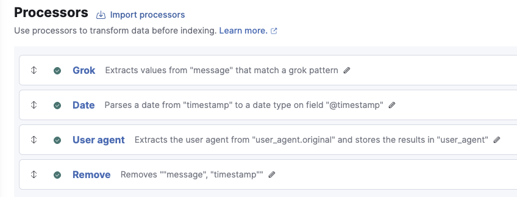

Only 4 processors, while `dissect` needed 7 (two `convert` and another `remove`), and if we'd accounted for all of the possible `-` fields, it would have needed 2 more conditional `remove` processors. Even if `dissect` is faster, adding the extra processors could slow it down to around the same speed as `grok`. Sometimes things tilt the scales more in favor of one or the other.

### Key value pairs

Splitting kv pairs is a job for the `kv` processor. Let's create a new pipeline and call it `kv_demo`. We'll start the same with a `set` processor. Instead of creating sample docs, since this demo only has one field to parse, we'll just put our value in the `set` processor.

**Field** `mykv`

**Value** `k1=key 1, k2=key 2, k3=key 3, k4=key 4, k5=key 5`
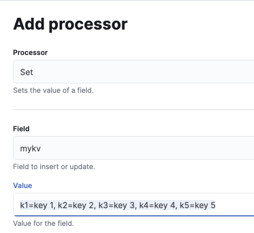

Now we'll create a `kv` processor:
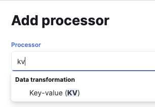

There are several configuration options we need to understand

**Field split**: Regex pattern used to delimit the key-value pairs. Typically a space character (`" "`). Our key/value pairs are, indeed, split with spaces, but also with commas `,`. So our value here should be `", "` (comma, space).

**Value split**: Regex pattern used to split keys and values. Typically an assignment operator (`"="`). Our keys and values are split by an `=` .

**Target field**: This is optional. If we specify nothing, the keys will show up at the root of the document.

**Include keys**: A list of keys to include. This option will only include named keys.

**Exclude keys**: A list of keys to exclude. This option will include all keys not named (excluded).

**Prefix**: Prefix to add to extracted keys

**Trim key**: Characters to trim from extracted keys

**Trim value**: Characters to trim from extracted values. This is especially useful with spaces, punctuation, etc.

**Strip brackets**: This switch, if set to "on," will automatically remove brackets ( `()`, `<>`, `[]`) and quotes (`'`, `"`) from extracted values.

Let's set our values as follows:

- **Field split** - `", "` (minus the quotes)
- **Value split** - `=` 
- **Target field** - `kvpairs` 

Since we still need a single document to test, we just cut/paste the example provided:
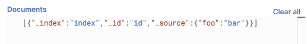

Now if we click on **View output** we see this:
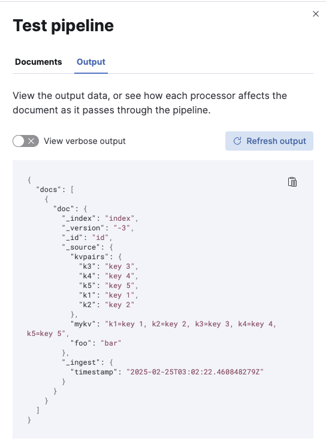

```
{
  "docs": [
    {
      "doc": {
        "_index": "index",
        "_version": "-3",
        "_id": "id",
        "_source": {
          "kvpairs": {
            "k3": "key 3",
            "k4": "key 4",
            "k5": "key 5",
            "k1": "key 1",
            "k2": "key 2"
          },
          "mykv": "k1=key 1, k2=key 2, k3=key 3, k4=key 4, k5=key 5",
          "foo": "bar"
        },
        "_ingest": {
          "timestamp": "2025-02-25T03:02:22.460848279Z"
        }
      }
    }
  ]
}
```

See how simple and easy that was?

Let's try the include/exclude options!

**Include keys** - `k2`

The output:

```
{
  "_index": "index",
  "_version": "-3",
  "_id": "id",
  "_source": {
    "kvpairs": {
      "k2": "key 2"
    },
    "mykv": "k1=key 1, k2=key 2, k3=key 3, k4=key 4, k5=key 5",
    "foo": "bar"
  },
  "_ingest": {
    "pipeline": "_simulate_pipeline",
    "timestamp": "2025-02-25T03:04:30.623789382Z"
  }
}
```

As mentioned, when **Include keys** is specified, only those included will appear.

Now let's try excluding `k2`

```
{
  "_index": "index",
  "_version": "-3",
  "_id": "id",
  "_source": {
    "kvpairs": {
      "k3": "key 3",
      "k4": "key 4",
      "k5": "key 5",
      "k1": "key 1"
    },
    "mykv": "k1=key 1, k2=key 2, k3=key 3, k4=key 4, k5=key 5",
    "foo": "bar"
  },
  "_ingest": {
    "pipeline": "_simulate_pipeline",
    "timestamp": "2025-02-25T03:05:41.690329166Z"
  }
}
```

And key `k2` is omitted.

Hopefully this gives a good idea of what the `kv` processor can help you do.

### Error handling

There are several ways to handle errors in Ingest Pipelines. 

**Field Existence**

- The field is okay to be missing
- 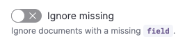
    Set the **Ignore Missing** flag

**Force Ignore Failures**

If it's just fine if the processor fails, set the **Ignore failures for this processor** flag:


**Use on_failure** 

There are actually 2 levels of **on_failure**

- Individual processor
- Whole pipeline

In this 101-level session, we will only be addressing the whole pipeline variety. The 201 and 301 sessions will go into more depth with the individual processor level.

At the pipeline level, if any of the processors fails (and there is no processor-level **on_failure**), then it will jump immediately to the pipeline-level **on_failure** block.

Each of these pipelines is executed in order as well.

Let's create an **on_failure** processor or two.

**The Append processor**

We can append a value to a field name that is already an array, or if the field does not exist or only has a single value, make it an array and append the value.
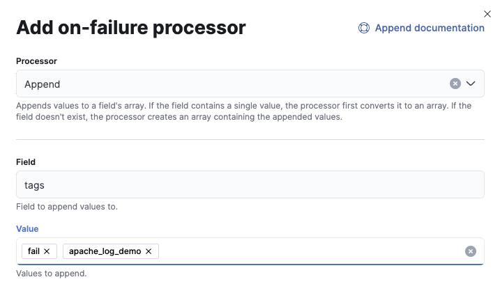

This will result in 2 elements being appended to the field `tags`: `fail` and `apache_log_demo`.

We will show these later when we create a failure condition.

**Set (well, change) the target index**

If we try to send the event when the pipeline has raised an error, it might not be fully processed. This might result in mapping conflicts or other issues. It might be wise to route this event to a different index. We can do this by changing the value of the `_index` field using a **Set** processor.
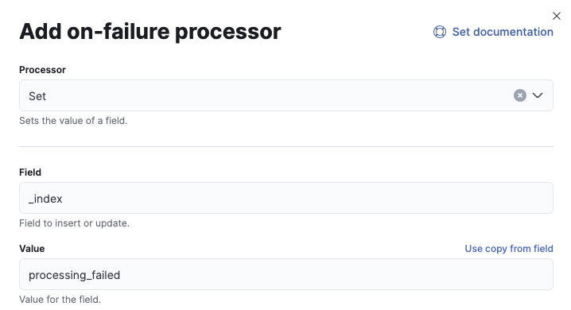

We still have no failures yet, so let's create a false failure just so we can see the output.
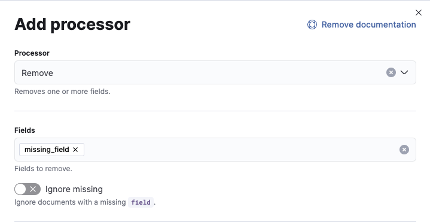

We are definitely _not_ going to **Ignore missing** here. We will also leave the **Ignore failures for this processor switch** (further down) off.

Save this, and we'll see something different in the main view:
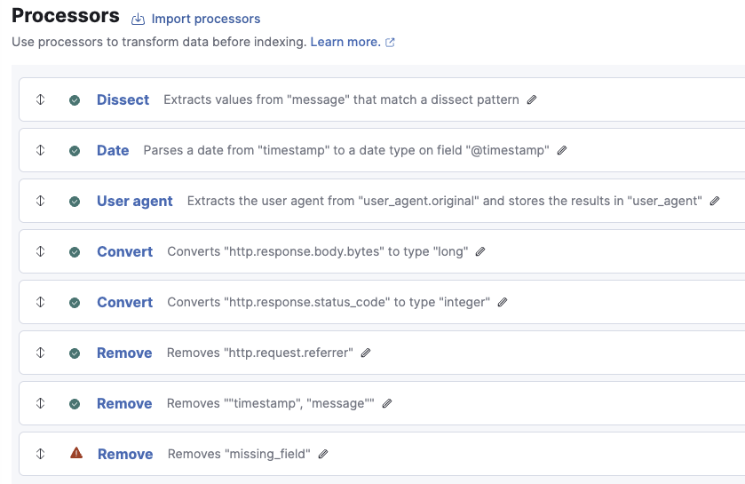

We have a danger triangle here that indicates this processor failed. Let's view the output of just this processor first. We do this by opening the processor (click on the **Remove**) and then navigating to the **Output** tab (which is only present if we have at least one test document).
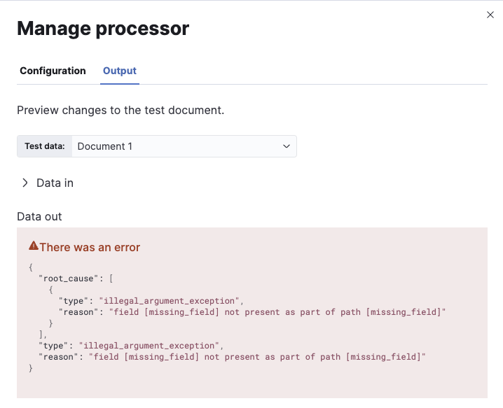

Our `missing_field` is missing. Let's view the test for entire pipeline next. Click on **View output** in the main view.

Shortening the output for readability:

```
{
  "docs": [
    {
      "doc": {
        "_index": "processing_failed",
...
        "_source": {
          "@timestamp": "2023-02-24T18:30:21.000Z",
...
          "tags": [
            "fail",
            "apache_log_demo"
          ]
        },
...
  ]
}
```

The value for `_index` has changed to `processing_failed`. This will ship the event to this index instead of the original destination.

We also see that field `tags` is an array with values `fail` and `apache_log_demo`.

But what if this generates a mapping conflict?

**Reordering processors**

If you plan on removing the `message` field, make that **Remove** the very last processor. If a failure occurs before that, then the `message` field will be intact, and we can ship _only_ that field to our `processing_failed` index.

From the main viewer, click on the up/down arrows to the left of our danger triangle
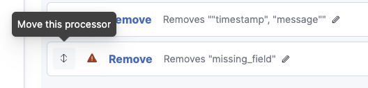

After "activating" this processor this way, you can move the mouse pointer to reposition the processor. Put it above the **Remove** that removes `timestamp` and `message`
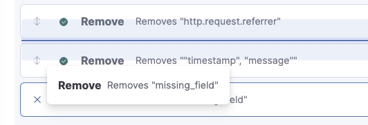

The dark blue line indicates where it will be positioned.
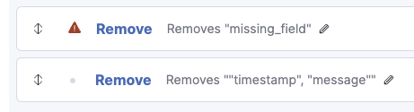

Next, add a **Remove** processor to the **On_failure** block.

Rather than delete every sub-field of an object, we can remove the root-level object.
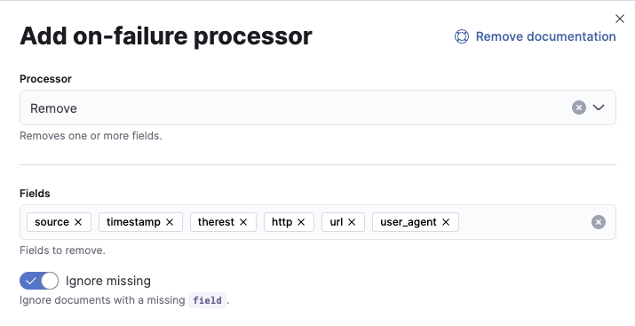

The result is much smaller now:

```
{
  "docs": [
    {
      "doc": {
        "_index": "processing_failed",
        "_version": "-3",
        "_id": "id",
        "_source": {
          "@timestamp": "2023-02-24T18:30:21.000Z",
          "message": "192.168.1.10 - - [24/Feb/2023:10:30:21 -0800] \"GET /home/index.html HTTP/1.1\" 200 1234 \"-\" \"Mozilla/5.0 (Windows NT 10.0; Win64; x64) AppleWebKit/537.36 (KHTML, like Gecko) Chrome/110.0.0.0 Safari/537.36\"",
          "tags": [
            "fail",
            "apache_log_demo"
          ]
        },
        "_ingest": {
          "timestamp": "2025-02-25T17:12:32.312515416Z"
        }
      }
    }
  ]
}
```

We keep `tags` and `message`. If we send `tags` from any failed ingest pipeline, they won't be a mapping conflict, and they'll help us track down what's not working.

What about `@timestamp`, though? Perhaps we'd rather have the time of ingestion for tracking purposes?

**Add another Set processor**
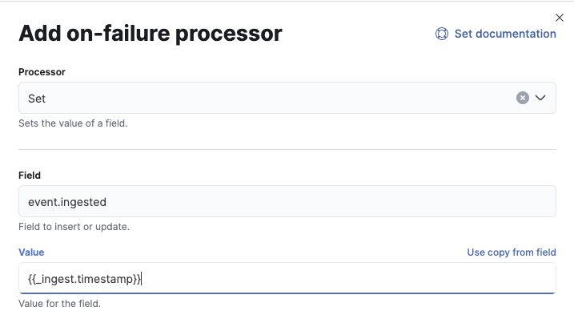

Remember when I pointed out the `_ingest.timestamp` value generated by the pipeline itself? It turns out we can use it here.

`event.ingested` is an ECS field that is useful for tracking when a document arrived in our pipeline(s). In this case, we can add it here to potentially help with debugging and reindexing at a future point. We will return to this use case in the 201 or 301 session!

Our results now from **View output**:

```
{
  "docs": [
    {
      "doc": {
        "_index": "processing_failed",
...
          "message": "192.168.1.10 - - [24/Feb/2023:10:30:21 -0800] \"GET /home/index.html HTTP/1.1\" 200 1234 \"-\" \"Mozilla/5.0 (Windows NT 10.0; Win64; x64) AppleWebKit/537.36 (KHTML, like Gecko) Chrome/110.0.0.0 Safari/537.36\"",
          "event": {
            "ingested": "2025-02-25T17:20:29.417620033Z"
          },
          "tags": [
            "fail",
            "apache_log_demo"
          ]
        },
        "_ingest": {
          "timestamp": "2025-02-25T17:20:29.417620033Z"
        }
...
}
```

You can now see that the value was copied from `_ingest.timestamp` to `event.ingested`
