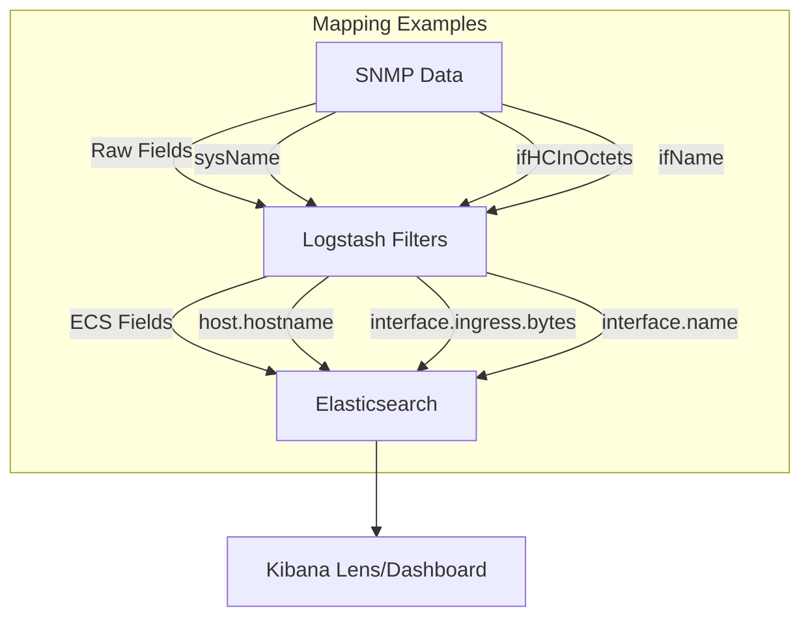

# ECS Mapping for SNMP Data

This document supports the "Ingesting SNMP Data 101" webinar, explaining how to map SNMP data to the Elastic Common Schema (ECS) for seamless querying and visualization in Kibana. It builds on the SNMP basics from [snmp_basics.md](./snmp_basics.md), connectivity from [connectivity_auth.md](./connectivity_auth.md), and data formatting from [mibs_formatting.md](./mibs_formatting.md), and is demonstrated in [live_demo.md](./live_demo.md).

## Why ECS?

The Elastic Common Schema (ECS) standardizes field names across data sources, enabling consistent querying, analysis, and visualization in Kibana. By mapping SNMP fields (e.g., `sysName`, `ifHCInOctets`) to ECS fields (e.g., `host.hostname`, `interface.ingress.bytes`), we ensure compatibility with Elastic's tools and dashboards.

## Mapping SNMP to ECS

Using generic MIBs (SNMPv2-MIB, IF-MIB) from [mibs_formatting.md](./mibs_formatting.md), we map key SNMP fields to ECS. Below are examples relevant to the demo:

| Field             | ECS Field                     | Description                                |
|-------------------|-------------------------------|--------------------------------------------|
| `ifName`          | `interface.name`              | Network interface name (e.g., "eth0").     |
| `ifAlias`         | `interface.alias`             | Interface alias as reported by the system. |
| `ifHCInOctets`    | `interface.ingress.bytes`     | Inbound network traffic (bytes).           |
| `ifHCOutOctets`   | `interface.egress.bytes`      | Outbound network traffic (bytes).          |
| `index`           | `interface.id`.               | Interface ID, typically the SNMP index.    |
| `sysName.0`       | `host.hostname`               | Device hostname.                           |
| Device IP         | `host.ip`                     | Device IP address.                         |

**Note**: Advanced mappings (e.g., dynamic IP resolution via enrichment) will be covered in "Ingesting SNMP Traps 201" (September 2025).

## Implementing in Logstash

After formatting in [mibs_formatting.md](./mibs_formatting.md), use Logstash filters to apply ECS mappings. Example from the demo config:

```ruby
filter {
  # Split the array field [snmp][interfaces] into individual events
  split { field => "[snmp][interfaces]" }

  # Rename fields for clarity
  mutate {
    rename => {
      "[snmp][RFC1158-MIB::sysName.0]" => "[host][hostname]"
      "[snmp][interfaces][IF-MIB::ifHCOutOctets]" => "[interface][egress][bytes]"
      "[snmp][interfaces][IF-MIB::ifHCInOctets]" => "[interface][ingress][bytes]"
      "[snmp][interfaces][IF-MIB::ifName]" => "[interface][name]"
      "[snmp][interfaces][IF-MIB::ifAlias]" => "[interface][alias]"
      "[snmp][interfaces][index]" => "[interface][id]"
    }
  }
}
```

## Visualizing in Kibana

Once ingested into Elasticsearch (data_stream: `metrics-network.snmp-*`), use Kibana to:

1. **Discover**: Query fields like `host.hostname` or `interface.egress.bytes`.
2. **Lens**: Create a vertical bar chart of `interface.egress.bytes` over time, split by `interface.name`.
3. **Dashboards**: Build reusable visualizations for monitoring (expanded in future sessions).

See [live_demo.md](./live_demo.md) for the full workflow.

## Diagram: SNMP to ECS Mapping



This shows how SNMP fields are transformed into ECS for visualization.

## Troubleshooting

- **Missing Fields**: Verify filter syntax and SNMP data availability (test with `snmpwalk` from [connectivity_auth.md](./connectivity_auth.md)).
- **Type Errors**: Ensure `convert` is applied to numeric fields.
- See [error_handling.md](./error_handling.md) for more tips.

## Next Steps

- Apply these mappings in [live_demo.md](./live_demo.md).
- Experiment with additional ECS fields (e.g., `event.category: "network"`).
- Stay tuned for advanced enrichment (e.g., dynamic IP-to-hostname mapping) in "Ingesting SNMP Traps 201".
