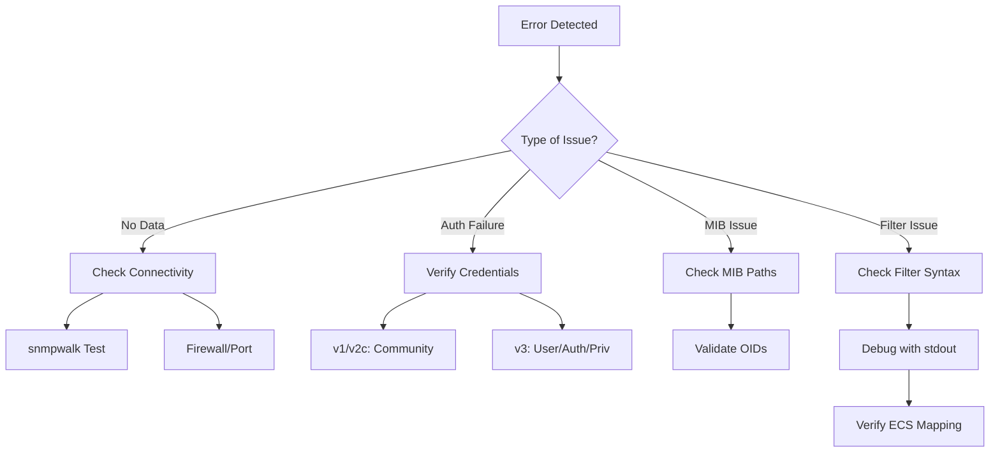

# Error Handling for SNMP Data Ingestion

This document supports the "Ingesting SNMP Data 101" webinar, providing guidance on troubleshooting common issues when using Logstash's SNMP input plugin to poll network devices. It covers errors related to connectivity, authentication, MIBs, and filters, building on concepts from [snmp_basics.md](./snmp_basics.md), [connectivity_auth.md](./connectivity_auth.md), [mibs_formatting.md](./mibs_formatting.md), and [ecs_mapping.md](./ecs_mapping.md). See [live_demo.md](./live_demo.md) for the practical context.

## Common Issues and Solutions

### 1. Connectivity Issues

**Problem**: Logstash receives no SNMP data or times out.

- **Symptoms**: No events in Elasticsearch, or Logstash logs show timeout errors.
- **Solutions**:
  - Verify device IP/port: Ensure the `host` field (e.g., `udp:127.0.0.1/1161`) matches your device or simulator ([snmpsim](https://github.com/etingof/snmpsim)).
  - Test with `snmpwalk`: Run `snmpwalk -v2c -c public 127.0.0.1:1161 sysDescr.0` to confirm connectivity (see [connectivity_auth.md](./connectivity_auth.md)).
  - Check firewall: Ensure UDP port 161 is open on the device.
  - Increase timeout in Logstash:

    ```ruby
    input {
      snmp {
        hosts => [{host => "udp:127.0.0.1/1161", community => "public"}]
        get => ["sysDescr.0"]
        timeout => 5  # Seconds
      }
    }
    ```

### 2. Authentication Failures

**Problem**: Invalid community string (v1/v2c) or v3 credentials.

- **Symptoms**: Logstash logs show "authentication failure" or "unknown user".
- **Solutions**:
  - **v1/v2c**: Verify the community string (e.g., `public`) matches the device’s configuration.

    ```bash
    snmpwalk -v2c -c public 127.0.0.1:1161 sysDescr.0
    ```

  - **v3**: Check username, auth protocol/password, and priv protocol/password.

    ```bash
    snmpwalk -v3 -l authPriv -u snmpuser -a SHA -A authpass -x AES -X privpass 127.0.0.1:1161 sysDescr.0
    ```

  - Update Logstash config (see [connectivity_auth.md](./connectivity_auth.md)):

    ```ruby
    input {
      snmp {
        hosts => [{host => "udp:127.0.0.1/1161", security_name => "snmpuser", security_level => "authPriv", auth_protocol => "SHA", auth_password => "authpass", priv_protocol => "AES", priv_password => "privpass"}]
        get => ["sysDescr.0"]
      }
    }
    ```

### 3. Filter and ECS Mapping Issues

**Problem**: Data is ingested but fields are missing, malformed, or incorrectly typed in Elasticsearch.

- **Symptoms**: Kibana shows empty fields (e.g., `interface.ingress.bytes`) or type errors.
- **Solutions**:
  - Check filter syntax (from [mibs_formatting.md](./mibs_formatting.md), [ecs_mapping.md](./ecs_mapping.md)):

    ```ruby
    filter {
      # Split the array field [snmp][interfaces] into individual events
      split { field => "[snmp][interfaces]" }

      # Rename fields for clarity
      mutate {
        rename => {
          "[snmp][RFC1158-MIB::sysName.0]" => "[host][hostname]"
          "[snmp][interfaces][IF-MIB::ifHCOutOctets]" => "[interface][egress][bytes]"
          "[snmp][interfaces][IF-MIB::ifHCInOctets]" => "[interface][ingress][bytes]"
          "[snmp][interfaces][IF-MIB::ifName]" => "[interface][name]"
          "[snmp][interfaces][IF-MIB::ifAlias]" => "[interface][alias]"
          "[snmp][interfaces][index]" => "[interface][id]"
        }
      }
    }
    ```

  - Verify SNMP data: Use `snmpwalk` to ensure OIDs return expected values.
  - Debug with Logstash logs: Add `stdout { codec => rubydebug }` to the output for inspection:

    ```ruby
    output {
      stdout { codec => rubydebug }
      elasticsearch { hosts => ["localhost:9200"], index => "snmp_data-%{+YYYY.MM.dd}" }
    }
    ```

## Diagram: Troubleshooting Workflow



This guides users through diagnosing SNMP ingestion issues.

## Additional Tips

- **Logstash Logs**: Check `/var/log/logstash/logstash-plain.log` for detailed errors.
- **Test Incrementally**: Start with a single OID (e.g., `sysDescr.0`) before adding complex filters.
- **Simulator**: Use [snmpsim](https://github.com/etingof/snmpsim) for reliable testing if device access is limited.

## Next Steps

- Apply these fixes in [live_demo.md](./live_demo.md).
- Experiment with your device or simulator to resolve errors.
- Advanced error handling for traps will be covered in "Ingesting SNMP Traps 201" (September 2025).
