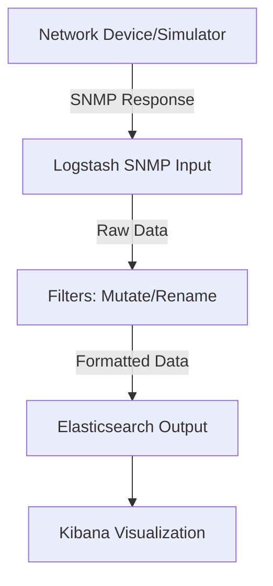
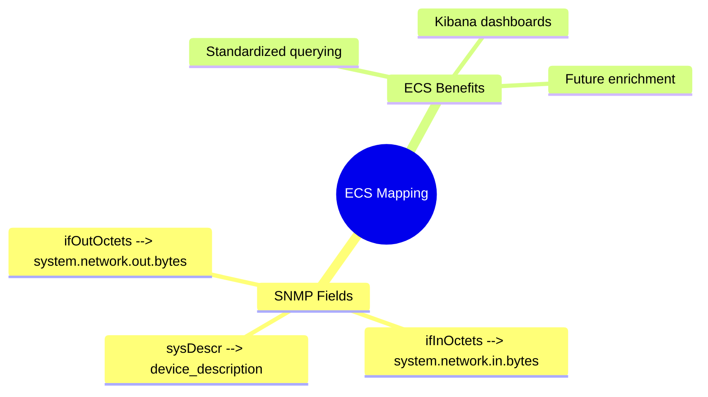

# Live Demo: Ingesting SNMP Data with Logstash

This document outlines the live demo for the "Ingesting SNMP Data 101" webinar. We'll demonstrate polling SNMP data from a generic network switch using Logstash's SNMP input plugin, formatting the data with filters, mapping to ECS fields, and verifying ingestion in Kibana. The demo assumes an Elastic Stack setup (version 8.x+) and an SNMP-enabled device or simulator (e.g., [snmpsim](https://github.com/etingof/snmpsim) for testing).

## Demo Objectives

- Poll basic system and interface metrics via SNMP v2c.
- Incorporate generic MIBs (e.g., SNMPv2-MIB, IF-MIB).
- Apply Logstash filters to clean and structure data.
- Map fields to ECS for visualization.
- Ingest into Elasticsearch and create a simple Kibana Lens.

Estimated time: 20 minutes.

## Step 1: Prepare Your Environment

- Start Logstash, Elasticsearch, and Kibana.
- Ensure the SNMP plugin is installed: `bin/logstash-plugin install logstash-integration-snmp`.
- Device setup: Use a switch with SNMP v2c enabled (community: `public`). For simulation:

  ```shell
  pip install snmpsim  # If not installed
  snmpsim-command-responder --data-dir=/path/to/snmprec --agent-udpv4-endpoint=127.0.0.1:1161
  ```

  (Use pre-recorded SNMP walks from public sources for realism.)

## Step 2: Basic SNMP Polling Config

Create a Logstash config file `snmp_poll.conf`:

```ruby
input {
  snmp {
    hosts => [{host => "udp:127.0.0.1/1161", community => "public"}]
    get => ["1.3.6.1.2.1.1.1.0"]  # sysDescr OID
    interval => 60  # Poll every 60 seconds
  }
}

filter {
  # Basic mutate for renaming
  mutate {
    rename => { "[snmp][sysDescr]" => "device_description" }
  }
}

output {
  elasticsearch {
    hosts => ["localhost:9200"]
    index => "snmp_data-%{+YYYY.MM.dd}"
  }
}
```

Run Logstash: `bin/logstash -f snmp_poll.conf`.

### Diagram: SNMP Polling Flow



This shows the high-level data flow from polling to ingestion.

## Step 3: Adding MIBs and More OIDs

Enhance the input to use MIBs for human-readable fields. Add paths to generic MIBs (download from [IANA](https://www.iana.org/assignments/ianamib) or Elastic docs).

Update `input` section:

```ruby
input {
  snmp {
    hosts => [{host => "udp:127.0.0.1/1161", community => "public"}]
    get => ["sysDescr.0", "ifDescr", "ifInOctets", "ifOutOctets"]  # Using MIB names
    mib_paths => ["/path/to/mibs/SNMPv2-MIB.txt", "/path/to/mibs/IF-MIB.txt"]
    interval => 60
  }
}
```

### Explanation

- `sysDescr.0`: System description (from SNMPv2-MIB).
- `ifDescr`, `ifInOctets`, `ifOutOctets`: Interface details (from IF-MIB).

## Step 4: Formatting with Filters

Add filters for ECS mapping:

```ruby
filter {
  # Grok for parsing if needed (e.g., extract interface name)
  grok {
    match => { "[snmp][ifDescr]" => "%{DATA:interface_name}" }
  }
  
  # Mutate for ECS fields
  mutate {
    add_field => {
      "[network][protocol]" => "snmp"
      "[host][ip]" => "127.0.0.1"  # Hardcoded for demo; enrich in future sessions
      "[system][network][in][bytes]" => "%{[snmp][ifInOctets]}"
      "[system][network][out][bytes]" => "%{[snmp][ifOutOctets]}"
    }
    convert => {
      "[system][network][in][bytes]" => "integer"
      "[system][network][out][bytes]" => "integer"
    }
  }
}
```

This maps SNMP metrics to ECS (e.g., `system.network.in.bytes` for inbound traffic).

## Step 5: Ingest and Verify

- Run the updated config.
- In Kibana:
  1. Go to Discover: Search index `snmp_data-*` for fields like `device_description`, `system.network.in.bytes`.
  2. Create a Lens: Vertical bar chart with `system.network.in.bytes` over time, split by `interface_name`.

### Diagram: ECS Mapping Example



## Step 6: Troubleshooting Tips

- If no data: Check snmpwalk `snmpwalk -v2c -c public 127.0.0.1 sysDescr.0`.
- Errors: Verify MIB paths, community string.
- For v3: Update `hosts` with auth (e.g., `user`, `auth_protocol`, `auth_password`).

## Homework

Adapt this config to poll your own device. Experiment with additional OIDs from IF-MIB.

This demo builds on filter basics from [2025-03-27](../2025-03-27/README.md) and teases enrichment from [2025-04-23](../2025-04-23/README.md). See the recording for full walkthrough!
