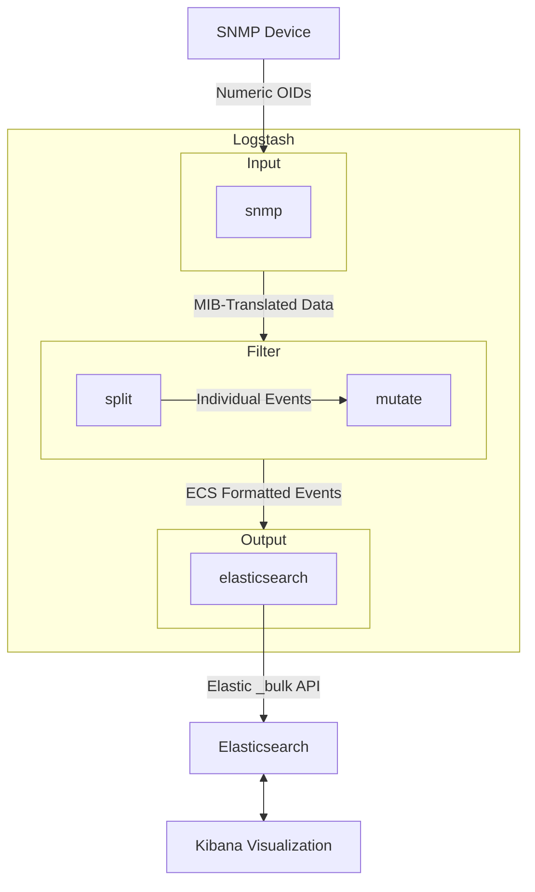

# Incorporating MIBs and Formatting Data

This document supports the "Ingesting SNMP Data 101" webinar, explaining how to incorporate generic MIBs (Management Information Bases) and use Logstash filters to format SNMP data for ingestion into Elasticsearch. It builds on the basics from [snmp_basics.md](./snmp_basics.md) and connectivity setup from [connectivity_auth.md](./connectivity_auth.md), preparing data for ECS mapping in [ecs_mapping.md](./ecs_mapping.md) and the live demo in [live_demo.md](./live_demo.md).

## What Are MIBs?

MIBs are files that act as dictionaries, defining the structure and meaning of SNMP data. The Logstash SNMP plugin uses them to translate numeric OIDs (e.g., `1.3.6.1.2.1.1.1.0`) into human-readable field names in output events (e.g., `SNMPv2-MIB::sysDescr.0`). Configurations require numeric OIDs as input—the plugin does not accept names like `sysDescr.0` and will error if used.

In this session, we use **bundled generic MIBs** (e.g., SNMPv2-MIB, IF-MIB from libsmi 0.5.0) for standard device data. Custom/vendor-specific MIBs (e.g., for proprietary metrics) require import (to `.dic` or `.yaml`) and will be covered in "Ingesting SNMP Traps 201" (September 2025).

## Step 1: Finding Numeric OIDs

Logstash requires *numeric* OIDs for `get`, `walk`, and `tables`. Use these tools to find them:

- `snmptranslate`: E.g., `snmptranslate -On SNMPv2-MIB::sysDescr.0` outputs `1.3.6.1.2.1.1.1.0`.
- A site to use to search for MIB names and browse OIDS. Examples include:
  - [MIB Browser Online](https://mibbrowser.online/mibdb_search.php)
  - [Observium MIB Browser](https://mibs.observium.org/mib/)
- `snmpwalk` or `snmpget`: Test with numeric OIDs to confirm data (e.g., `snmpget -v2c -c public 127.0.0.1 1.3.6.1.2.1.1.1.0`).

Key OIDs for this session:

- `1.3.6.1.2.1.1.1.0` (sysName.0): Device description (e.g., "Generic Switch XYZ").
- Interface table (IF-MIB):
  - `1.3.6.1.2.1.2.2.1.2` (ifDescr): Interface name.
  - `1.3.6.1.2.1.2.2.1.10` (ifInOctets): Inbound bytes.
  - `1.3.6.1.2.1.2.2.1.16` (ifOutOctets): Outbound bytes.

## Step 2: Configuring MIBs and Advanced Options

The Logstash SNMP plugin bundles IETF MIBs (e.g., SNMPv2-MIB, IF-MIB), so no `mib_paths` is needed for generics. Advanced options control output field names and structure:

- `oid_mapping_format`: Controls field name style:
  - `default`: Full dotted, named path (e.g., `[snmp][iso.org.dod.internet.mgmt.mib-2.system.sysDescr.0]`).
  - `ruby_snmp`: MIB-based (e.g., `[snmp][SNMPv2-MIB::sysDescr.0]`).
  - `dotted_string`: Numeric OID (e.g., `[snmp][1.3.6.1.2.1.1.1.0]`).
- `oid_map_field_values`: (Boolean) If `true`, maps OID values to names (e.g., for enumerated types) as indicated by `oid_mapping_format`. The default is `false` according to the documentation, but setting `oid_mapping_format => "ruby_snmp"` seems to work without setting this to `true`, so that may be an inconsistency in the documentation.
- `oid_root_skip`: (Integer) skips prefix digits in field names (e.g., `6` skips `1.3.6.1.2.1`, which is `iso.org.dod.internet.mgmt.mib-2`). This setting can be used only if `oid_mapping_format` is set to `default`. Mutually exclusive of `oid_path_length`.
- `oid_path_length`: (Integer) limits OID path segments retained (e.g., `2` for `system.sysDescr.0`). Use this setting only if `oid_mapping_format` is set to `default`. Mutually exclusive of `oid_root_skip`.
- `target`: Highly Recommended. Namespaces data (e.g., `snmp` for `[snmp][...]`). No default value.

### When might you want to use each `oid_mapping_format`?

In most cases, you will want to rename the fields to something easy to read, easy to recognize, and easy to search or enter as field names in Kibana for querying and making visualizations.  Personally, I find that `ruby_snmp` makes this easiest, as the resulting names are generally easy to understand and shorter than the full path of `default`. However, some might want to map the entirety of what they pull to a `flattened` mapping type field, which would allow easy navigation to sub-fields. I do not expect this is common, but I can imagine some use cases for it.

Another case might be when you are using alongside existing systems and need the original OID to be present. In such a case, you'd use `dotted_string`.

**Implications for Renaming**:

- `oid_mapping_format => "ruby_snmp"` produces shorter, MIB-based names, easier for filter renaming (e.g., `[snmp][SNMPv2-MIB::sysDescr.0]` to `device_description`).
- `oid_root_skip` and `oid_path_length` reduce field name length but may lose context, requiring careful filter adjustments.
- Test output with `stdout`/`rubydebug` to confirm field names before renaming (see [connectivity_auth.md](./connectivity_auth.md)).

Example config (used in [live_demo.md](./live_demo.md)):

```ruby
input {
  snmp {
    hosts => [{host => "udp:127.0.0.1/1161", community => "public"}]
    get => [ "1.3.6.1.2.1.1.5.0" ]
    tables => [{
      "name" => "interfaces",
      "columns" => [ "1.3.6.1.2.1.31.1.1.1.1", "1.3.6.1.2.1.31.1.1.1.6", "1.3.6.1.2.1.31.1.1.1.10", "1.3.6.1.2.1.31.1.1.1.18" ]
    }]
    target => "snmp"
    ecs_compatibility => "v8"
    oid_mapping_format => "ruby_snmp"

    interval => 60
  }
}
```

## Step 3: Formatting with Logstash Filters

Raw SNMP data (MIB-mapped) needs cleaning and structuring for Elasticsearch. Use filters (building on [2025-03-27](../2025-03-27/README.md)) to rename fields, parse data, and prepare for ECS mapping. Filters depend on `oid_mapping_format` and other options.

Example filter pipeline (assuming `oid_mapping_format => "ruby_snmp"`, `oid_root_skip => 6`):

```ruby
filter {
  # Split the array field [snmp][interfaces] into individual events
  split { field => "[snmp][interfaces]" }

  # Rename fields for clarity
  mutate {
    rename => {
      "[snmp][RFC1158-MIB::sysName.0]" => "[host][hostname]"
      "[snmp][interfaces][IF-MIB::ifHCOutOctets]" => "[interface][egress][bytes]"
      "[snmp][interfaces][IF-MIB::ifHCInOctets]" => "[interface][ingress][bytes]"
      "[snmp][interfaces][IF-MIB::ifName]" => "[interface][name]"
      "[snmp][interfaces][IF-MIB::ifAlias]" => "[interface][alias]"
      "[snmp][interfaces][index]" => "[interface][id]"
    }
  }
}
```

- **mutate rename**: Simplifies field names based on MIB mapping (adjust based on `oid_mapping_format` and `oid_root_skip`).
- **grok**: Extracts meaningful parts from complex fields (e.g., interface names).
- **mutate convert**: Ensures numeric fields are typed as `long` for Elasticsearch (counters like `ifInOctets` require `long` for large values).
- Use `stdout`/`rubydebug` to inspect field names before renaming (see [connectivity_auth.md](./connectivity_auth.md)).

## Step 4: Using ECS: Elastic Common Schema

You may have noticed that we are using ECS mappings in the mutate rename block. There's more about ECS in [ecs_mapping.md](./ecs_mapping.md).

Enable `ecs_compatibility => "v8"` in the input or `pipeline.ecs_compatibility: v8` in `logstash.yml` to ensure field compatibility and avoid conflicts in Elasticsearch.

### Diagram: Data Transformation Process



This shows how MIBs and filters transform raw SNMP data into structured, ECS-ready output.

## Troubleshooting

- **Invalid OIDs**: Ensure numeric format (e.g., `1.3.6.1.2.1.1.1.0`); test with `snmpwalk`. The plugin errors on names like `sysDescr.0`.
- **Field Naming Issues**: Use `stdout`/`rubydebug` to inspect output fields (including `@metadata`). Adjust `oid_mapping_format`, `oid_root_skip`, or `oid_path_length` as needed.
- **Missing MIBs**: For custom MIBs, import to `.dic` or `.yaml` and add `mib_paths` (covered in 201 session).
- **Filter Errors**: Check Logstash logs for parsing issues. See [error_handling.md](./error_handling.md).
- Refer to [SNMP input plugin docs](https://www.elastic.co/guide/en/logstash/current/plugins-inputs-snmp.html) for details.

## Next Steps

- Test the above config with your device or [snmpsim](https://github.com/etingof/snmpsim).
- Use `stdout`/`rubydebug` to verify event structure and `@metadata`.
- See [live_demo.md](./live_demo.md) for a full example with these filters.
- Explore ECS mapping in [ecs_mapping.md](./ecs_mapping.md) for visualization.
- Stay tuned for custom MIBs in "Ingesting SNMP Traps 201".
