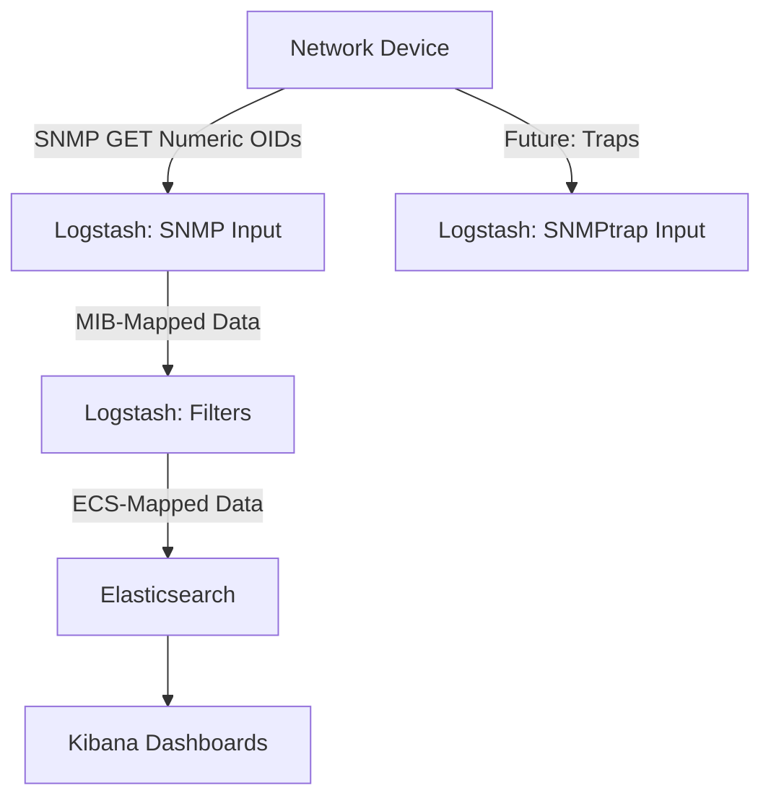

# SNMP Basics

This document supports the "Ingesting SNMP Data 101" webinar, providing an overview of the Simple Network Management Protocol (SNMP) and its integration with Logstash for network device monitoring. It covers the protocol's purpose, key concepts like OIDs, MIBs, and tables, and why Logstash is a great fit for ingestion.

## What is SNMP?

SNMP is a standard protocol for monitoring and managing network devices (e.g., routers, switches, servers). It allows a central system (like Logstash) to:

- **Poll** devices for metrics (e.g., CPU usage, interface traffic).
- Retrieve system information (e.g., device hostname, uptime).
- (Future topic: Receive **traps**, or unsolicited alerts, covered in "Ingesting SNMP Traps 201".)

SNMP operates over UDP (typically port 161 for polling, 162 for traps) and is widely supported across network hardware.

## Key Concepts

- **OIDs (Object Identifiers)**: Unique numeric identifiers for data points, structured as dotted strings (e.g., `1.3.6.1.2.1.1.5.0` for `sysName.0`). OIDs act as addresses for specific metrics or attributes. The dotted numeric structure enables efficient processing and deep nesting without names.
- **MIBs (Management Information Bases)**: Files that define OID structures and map numeric OIDs to human-readable names in output events (e.g., translating `1.3.6.1.2.1.1.5.0` to `RFC1158-MIB::sysName.0`). The Logstash SNMP plugin uses MIBs for output field naming only—input configurations require numeric OIDs. The plugin bundles standard IETF MIBs (e.g., SNMPv2-MIB, IF-MIB); custom/vendor-specific MIBs require import and will be explored in the 201 session.
- **SNMP Tables**: Tables organize related data in rows, with each row (entry) indexed by a unique identifier. For example, `ifXTable` (1.3.6.1.2.1.31.1.1) contains entries (`ifXEntry`) for each network interface, with columns like `ifName` (1.3.6.1.2.1.31.1.1.1.1) and `ifHCInOctets` (1.3.6.1.2.1.31.1.1.1.6). Use `snmpwalk` to retrieve all entries in a table, as `snmpget` only fetches a single value (scalar or specific indexed entry).
- **SNMP Versions**:
  - v1: Basic, limited security (community strings).
  - v2c: Enhanced features, still uses community strings.
  - v3: Secure with authentication and encryption.
  (See [connectivity_auth.md](./connectivity_auth.md) for setup details.)

## Why Logstash for SNMP?

Logstash's SNMP input plugin simplifies polling devices, parsing responses, and formatting data for Elasticsearch. Benefits include:

- Flexible polling of multiple numeric OIDs and devices using `get`, `walk`, or `tables`.
- Integration with filters for data shaping (e.g., `mutate`, `split`, as seen in [2025-03-27](../2025-03-27/README.md)).
- Seamless ECS mapping for Kibana visualizations and correlation with other data (see [ecs_mapping.md](./ecs_mapping.md)).
- Extensibility for advanced use cases like traps or enrichment (teased in [2025-04-23](../2025-04-23/README.md)).
- Options like `oid_mapping_format` to control output field names based on MIBs.

## How It Works

Logstash uses the SNMP input plugin to:

1. Send GET or WALK requests to a device for specific numeric OIDs (or tables for tabular data).
2. Receive responses and use bundled MIBs to map OIDs to named fields in events.
3. Apply filters to structure data (e.g., split tables, rename fields).
4. Output to Elasticsearch for querying and visualization.

Important: Configurations must use numeric OIDs (e.g., `1.3.6.1.2.1.1.5.0`). The plugin does not resolve names like `sysName.0` in input parameters—it will error. Use tools like `snmptranslate` or [MIB Browser Online](https://mibbrowser.online/mibdb_search.php) to find OIDs.

### Diagram: SNMP in the Elastic Stack



This illustrates polling (this session) and hints at traps (next session).

## Getting Started

- **Bundled MIBs**: The plugin includes standard IETF MIBs like SNMPv2-MIB (for `1.3.6.1.2.1.1.5.0` → `RFC1158-MIB::sysName.0`) and IF-MIB (for interface stats like `1.3.6.1.2.1.31.1.1.1.1` → `IF-MIB::ifName`). No download needed for generics.
- **Finding OIDs**: Use `snmptranslate -On SNMPv2-MIB::sysName.0` to get the numeric OID (`1.3.6.1.2.1.1.5.0`). Or browse [MIB Browser Online](https://mibbrowser.online/mibdb_search.php) (primary) or [Observium MIB Browser](https://mibs.observium.org/mib/) (alternative).
- **Testing with `snmpget` and `snmpwalk`**:
  - Use `snmpget` for scalar OIDs or specific table entries:

    ```bash
    snmpget -v2c -c public 127.0.0.1:1161 1.3.6.1.2.1.1.5.0
    ```

    Expected output: `RFC1158-MIB::sysName.0 = STRING: "switch.example.com"`.

    ```bash
    snmpget -v2c -c public 127.0.0.1:1161 1.3.6.1.2.1.31.1.1.1.1.1
    ```

    Expected output: `IF-MIB::ifName.1 = STRING: "lo"`.
  - Use `snmpwalk` for tables to retrieve all entries:

    ```bash
    snmpwalk -v2c -c public 127.0.0.1:1161 -m ALL -Pce 1.3.6.1.2.1.31.1.1
    ```

    Expected output: Interface data (e.g., `IF-MIB::ifName.1 = STRING: "lo"`, `IF-MIB::ifName.65 = STRING: "Eth1/9"`).
    Note: `snmpget` on `1.3.6.1.2.1.31.1.1` (the table `ifXTable`) fails because it’s not a single value; `snmpwalk` is required to iterate over all `ifXEntry` rows.
- **Troubleshooting**: Use `stdout` with `rubydebug` codec to inspect event structure, including `@metadata` fields (see [connectivity_auth.md](./connectivity_auth.md)).
- **Demo**: See [live_demo.md](./live_demo.md) for a hands-on example polling a switch.

### Why Use `snmpwalk` for Tables?

SNMP tables, like `ifXTable` (1.3.6.1.2.1.31.1.1), organize data in rows (`ifXEntry`) with columns (e.g., `ifName`, `ifHCInOctets`). Each row is indexed (e.g., `1.3.6.1.2.1.31.1.1.1.1.1` for `ifName` of index 1). `snmpget` retrieves a single value (e.g., a scalar like `sysName.0` or a specific table entry like `ifName.1`), but fails for a table OID like `1.3.6.1.2.1.31.1.1` because it represents multiple values. `snmpwalk` iterates over all table entries, making it essential for fetching all interfaces in Logstash’s `tables` configuration.

## Next Steps

Experiment with polling `1.3.6.1.2.1.1.5.0` or table OIDs like `1.3.6.1.2.1.31.1.1.1.1` on your device. Check [mibs_formatting.md](./mibs_formatting.md) for MIB integration and [ecs_mapping.md](./ecs_mapping.md) for visualization tips. Stay tuned for "Ingesting SNMP Traps 201" to explore reactive monitoring!
