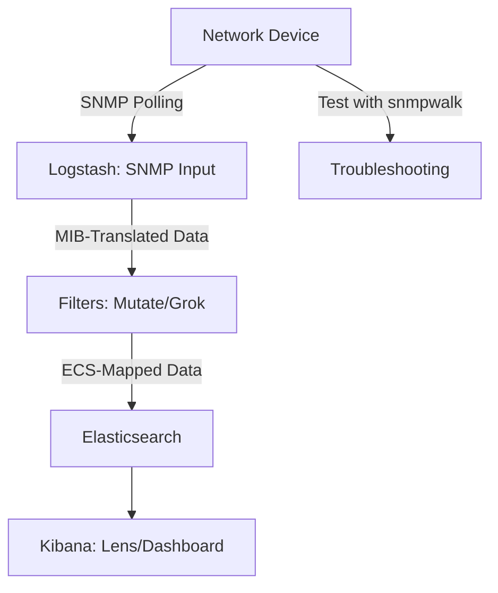

# Summary: Ingesting SNMP Data 101

This document wraps up the "Ingesting SNMP Data 101" webinar, summarizing key points, providing homework to apply what you learned, and teasing the next session in the "Ingest With Aaron" series. It builds on concepts from [snmp_basics.md](./snmp_basics.md), [connectivity_auth.md](./connectivity_auth.md), [mibs_formatting.md](./mibs_formatting.md), [ecs_mapping.md](./ecs_mapping.md), and [live_demo.md](./live_demo.md).

## Key Takeaways

- **SNMP Basics**: SNMP is a protocol for polling network device metrics (e.g., interface traffic) using OIDs and MIBs as dictionaries for human-readable names (see [snmp_basics.md](./snmp_basics.md)).
- **Connectivity and Authentication**: Configure Logstash for SNMP v1, v2c (community strings), or v3 (secure auth/encryption), and test with `snmpwalk` (see [connectivity_auth.md](./connectivity_auth.md)).
- **MIBs and Formatting**: Use generic MIBs (e.g., SNMPv2-MIB, IF-MIB) to translate OIDs and apply Logstash filters (mutate, grok) to structure data (see [mibs_formatting.md](./mibs_formatting.md)).
- **ECS Mapping**: Map SNMP fields to ECS (e.g., `sysDescr` to `host.name`, `ifInOctets` to `system.network.in.bytes`) for Kibana visualizations (see [ecs_mapping.md](./ecs_mapping.md)).
- **Troubleshooting**: Address connectivity, auth, MIB, or filter issues using `snmpwalk` and Logstash logs (see [error_handling.md](./error_handling.md)).
- **Live Demo**: Polled a switch, formatted data, and visualized metrics in Kibana (see [live_demo.md](./live_demo.md)).

## Workflow Summary

This recaps the flow from polling to visualization, with troubleshooting as a key step.

## Homework

1. **Poll Your Device**: Adapt the demo config from [live_demo.md](./live_demo.md) to poll an SNMP-enabled device (or simulator like [snmpsim](https://github.com/etingof/snmpsim)) for `sysDescr` and `ifInOctets`.
2. **Create a Visualization**: In Kibana, build a Lens chart for `system.network.in.bytes` over time, split by `interface.name`.
3. **Test Troubleshooting**: Use `snmpwalk` to verify an OID (e.g., `snmpwalk -v2c -c public <device-ip> sysDescr.0`) and fix any errors (see [error_handling.md](./error_handling.md)).

## Next Steps

- Review the webinar recording and configs in this repo: [github.com/untergeek/ingest_with_aaron](https://github.com/untergeek/ingest_with_aaron).
- Explore additional OIDs in IF-MIB or SNMPv2-MIB for more metrics.
- Join us for **"Ingesting SNMP Traps 201"** (tentative: September 2025), where we'll cover reactive trap ingestion, custom MIBs, and advanced ECS enrichment.

Thank you for joining us on August 27, 2025! See you next time!
